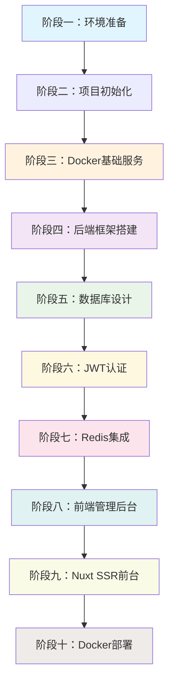

# Blog-SSR 系统操作手册(v1.0.0)

## 📖 文档概述
本文档是 Blog-SSR 系统的完整操作手册，旨在帮助开发者从零开始搭建和运行整个博客系统。系统采用现代化的全栈技术栈，包含前后端分离架构、SSR优化、Docker容器化部署等特性。

> 注: 操作手册 是一步一步的项目框架搭建说明, 暂时忋完成了核心功能, 其余开发中的功能还在补充中.

> 注: 操作手册 是一步一步的项目框架搭建说明, 这里出现的代码 是参考项目源码(下载地址: `git clone https://github.com/pengtaohenry1213-prog/Blog`), 所以有些部分的代码略有差异, 这点要注意.

### 🎯 适用读者
- 新加入项目的开发者
- 需要从零搭建项目的工程师
- 运维人员进行系统部署

### 🎯 项目当前状态
**已完成的核心功能：**
- ✅ 完整的Docker容器化环境
- ✅ JWT用户认证系统（包含前端登录界面）
- ✅ MySQL + Redis数据存储
- ✅ Express后端API框架
- ✅ Nginx反向代理配置
- ✅ 前后端基础架构
  - [x] 前端登录页面可正常使用
  - [x] 后端 API 接口响应正常

**开发中的功能：**
- 🚧 文章管理系统（后端模型和API）
- 🚧 前端管理后台完整功能
- 🚧 Nuxt SSR前台页面

**⚠️ 需要补充的功能：**
- [ ] 文章模型定义和数据库迁移
- [ ] 文章管理 API 接口
- [ ] 前端文章管理界面
- [ ] 用户权限管理
- [ ] 统计数据展示

### 📋 前置要求
- 熟悉 Node.js 开发环境
- 了解 Docker 和容器化概念
- 具备基本的 Linux/macOS 命令行操作能力

### 🎯 开发工作流选择指南

**重要提醒：开发阶段优先使用本地开发模式**

#### 开发环境推荐方案

**🎨 本地开发模式（推荐用于日常开发）**
```bash
# 启动基础设施服务（MySQL + Redis）
pnpm run docker-dev:up:redis
pnpm run docker-dev:up:mysql

# 本地启动后端服务（支持热重载）
pnpm run dev:backend

# 本地启动前端服务
pnpm run dev:frontend
```

**🐳 Docker 开发模式（适用于集成测试）**
```bash
# docker 容器创建&部署
pnpm run docker:build

# 完整容器化环境启动
pnpm run docker:up
```

#### 两种模式的对比

| 方面 | 本地开发模式 | Docker 开发模式 |
|------|-------------|----------------|
| **启动速度** | ~3秒 ⚡ | ~30秒 🐌 |
| **热重载** | 即时响应 ⚡ | 需要 volume 映射 |
| **调试体验** | 优秀（断点调试） | 一般 |
| **资源占用** | 低 | 高 |
| **文件访问** | 直接访问 | 通过 volume |
| **适用场景** | 日常开发、代码编写 | 集成测试、演示环境 |

#### 开发阶段最佳实践

1. **基础设施服务使用 Docker**
   - MySQL 和 Redis 建议一直使用 Docker 容器
   - 保证环境一致性和数据持久化

2. **应用服务使用本地模式**
   - 后端服务：`pnpm run dev:backend`（支持热重载）
   - 前端服务：`pnpm run dev:frontend`（Vite 热重载）
   - Nuxt 服务：`pnpm run dev:nuxt`（如需要）

3. **何时使用 Docker 模式**
   - 全栈集成测试时
   - 向团队演示功能时
   - 模拟生产环境配置时
   - CI/CD 自动化测试时

---

**执行顺序总览表**

| 阶段 | 任务 | 当前状态 | 是否必须 |
|------|------|----------|----------|
| 1-5 | 基础环境到数据库 | ✅ 已完成 | ✅ |
| 6 | JWT认证系统 | ✅ 已完成 | ✅ |
| 7 | Redis缓存集成 | ✅ 已完成 | ✅ |
| 8 | 前端后台管理 | ⚠️ 部分完成 | ❌ |
| 9 | Nuxt SSR前台 | ⚠️ 部分完成 | ❌ |
| 10 | Docker化部署 | ✅ 已完成 | ❌ |

当前顺序： 环境准备 → 项目初始化 → Docker基础服务 → 后端基础框架搭建（Express + 中间件 + 工具函数） → 数据库设计与初始化（模型定义 + 初始化脚本 + 数据库同步） → JWT认证系统 → Redis缓存集成 → 前端后台管理

### 🔗 阶段依赖关系图



**依赖说明**
- 🟦 **基础设施层**：环境准备、项目初始化、Docker基础服务
- 🟣 **后端核心层**：Express框架、数据库设计、JWT认证
- 🔴 **缓存增强层**：Redis缓存集成
- 🟢 **前端展示层**：后台管理、SSR前台
- 🟤 **生产部署层**：容器化部署


**阶段标题检查**
- 阶段一：基础运行环境准备
- 阶段二：项目结构初始化
- 阶段三：Docker 基础服务配置
- 阶段四：后端基础框架搭建
- 阶段五：数据库设计与初始化
- 阶段六：JWT认证系统
- 阶段七：Redis初始化
- 阶段八：前端后台管理
- 阶段九：Nuxt SSR 前台（可选）
- 阶段十：Docker 化部署

**关键依赖关系：**
- 阶段4 依赖 阶段3（数据库连接）
- 阶段5依赖 阶段4（Sequelize实例）
- 阶段6 依赖 阶段5（用户模型）
- 阶段7 依赖 阶段6（JWT服务）
- 阶段8-9 依赖 阶段6（认证接口）
- 
---

## 阶段一：基础运行环境准备

### 🎯 本阶段目标
确保本地开发环境具备运行 Blog-SSR 项目的最低要求。

### ✅ 预期结果
- 所有必需工具正确安装并可正常运行
- Node.js ≥ 18.0.0, pnpm ≥ 9.0.0, Docker ≥ 24.0.0
- Docker 引擎正常运行，可创建和启动容器
- 网络连接正常，可访问 Docker Hub

### 📏 验证标准
| 检查项 | 验证命令 | 期望结果 |
|--------|----------|----------|
| Node.js 版本 | `node --version` | ≥ 18.0.0 |
| pnpm 版本 | `pnpm --version` | ≥ 9.0.0 |
| Docker 版本 | `docker --version` | ≥ 24.0.0 |
| Docker 引擎状态 | `docker info` | 无错误输出 |
| Docker Hub 连接 | `curl -fsSL https://registry-1.docker.io/v2/` | HTTP 200 |
| 磁盘空间 | `df -h` | 可用空间 ≥ 5GB |


### 📦 技术栈详情
- **容器化**: Docker + Docker Compose
- **代码规范**: ESLint + Prettier + Husky + lint-staged
- **concurrently**: Node.js 命令行工具, 功能是在同一个终端窗口中，并行（同时）运行多个命令行命令，而无需打开多个终端分别执行。

### 📋 环境依赖清单
| 工具 | 版本要求 | 安装方式 | 验证命令 |
|------|----------|----------|----------|
| Node.js | ≥ 18.0.0 | [官网下载](https://nodejs.org/) | `node --version` |
| pnpm | ≥ 9.0.0 | `npm install -g pnpm` | `pnpm --version` |
| Docker | ≥ 24.0.0 | [Docker Desktop](https://www.docker.com/products/docker-desktop) | `docker --version` |
| Docker Compose | ≥ 2.0.0 | 随 Docker Desktop | `docker compose version` |
| Git | ≥ 2.30.0 | 系统包管理器 | `git --version` |
| concurrently | ≥ 9.0.0 | `pnpm add -D concurrently` | 已随项目安装 |

**技术栈版本详情：**
| 组件 | 版本 | 说明 |
|------|------|------|
| **后端** | | |
| Express | 4.18.2 | Web 框架 |
| Sequelize | 6.37.7 | ORM |
| MySQL2 | 3.6.5 | 数据库驱动 |
| Redis | 4.6.12 | 缓存客户端 |
| JWT | 9.0.2 | 身份认证 |
| **前端后台管理** | | |
| Vue | 3.5.24 | 前端框架 |
| Vite | rolldown-vite@7.2.5 | 构建工具 |
| Element Plus | 2.13.0 | UI 组件库 |
| Pinia | 3.0.4 | 状态管理 |
| **SSR前台** | | |
| Nuxt | 3.12.0 | SSR 框架 |
| **容器化** | | |
| MySQL | 8.0 | 数据库 |
| Redis | 8.4.0 | 缓存 |
| Nginx | Alpine | 反向代理 |


### 📁 项目结构概览
```bash
Blog-SSR/
├── packages/
│ ├── backend/ # Node.js + Express 后端服务
│ │ ├── app.js # 应用入口文件
│ │ ├── config/ # 配置文件 (数据库、Redis、JWT等)
│ │ ├── models/ # Sequelize 数据模型
│ │ ├── modules/ # 业务模块 (auth, article, user, stats)
│ │ ├── middleware/ # 中间件 (auth, logger, rateLimiter等)
│ │ ├── utils/ # 工具函数 (bcrypt, jwt, logger等)
│ │ ├── scripts/ # 初始化和维护脚本
│ │ ├── logs/ # 日志文件目录
│ │ └── package.json # 后端依赖配置
│ ├── frontend/ # Vue3 + Vite 前端后台管理
│ │ ├── src/
│ │ │ ├── api/ # API 接口封装
│ │ │ ├── components/ # 组件
│ │ │ ├── views/ # 页面组件 (admin/, frontend/)
│ │ │ ├── stores/ # Pinia 状态管理
│ │ │ ├── router/ # 路由配置
│ │ │ ├── composables/ # 组合式函数
│ │ │ ├── utils/ # 工具函数
│ │ │ └── workers/ # Web Workers
│ │ ├── public/ # 静态资源
│ │ └── vite.config.js # Vite 配置
│ ├── nuxt-ssr/ # Nuxt3 SSR 前台首页
│ │ ├── pages/ # 页面路由
│ │ ├── components/ # 组件
│ │ ├── layouts/ # 布局
│ │ ├── composables/ # 组合式函数
│ │ ├── stores/ # Pinia 状态管理
│ │ ├── server/ # 服务端 API 和中间件
│ │ └── nuxt.config.ts # Nuxt 配置
│ └── common/ # 前后端共享模块
│ ├── types/ # TypeScript 类型定义
│ └── utils/ # 共享工具函数
├── docker/ # Docker 配置和脚本
│ ├── docker-compose.yml # 完整服务编排
│ ├── docker-compose.dev.yml # 开发环境配置
│ ├── backend/ # 后端容器配置
│ ├── frontend/ # 前端容器配置
│ ├── nuxt/ # Nuxt 容器配置
│ ├── nginx/ # Nginx 反向代理配置
│ └── scripts/ # 初始化脚本 (init.sql等)
├── pnpm-workspace.yaml # pnpm 工作区配置
├── package.json # 根项目配置和脚本
└── README.md # 项目说明
```

### 当前项目状态分析

**已有的资源：**
- ✅ Node.js、pnpm、Docker、Docker Compose 安装验证
- ✅ 技术栈版本清单已定义

**缺失的部分：**
- ❌ 项目代码和配置

### 🧭 操作步骤

#### 1. 安装 Node.js
```bash
# 使用 nvm 管理 Node.js 版本（推荐）
curl -o- https://raw.githubusercontent.com/nvm-sh/nvm/v0.39.0/install.sh | bash
source ~/.bashrc
nvm install 18
nvm use 18
```

#### 2. 安装 pnpm
```bash
npm install -g pnpm
```

#### 3. 安装 Docker Desktop
- 访问 [Docker 官网](https://www.docker.com/products/docker-desktop)
- 下载对应操作系统版本
- 完成安装并启动 Docker Desktop

### ✅ 验证方式

运行以下命令验证环境准备完成：

```bash
# 1. 版本检查
node --version          # 应显示 ≥ 18.0.0
pnpm --version          # 应显示 ≥ 6.11.0
docker --version        # 应显示 ≥ 24.0.0
docker compose version  # 应显示 ≥ 2.0.0

# 2. Docker 引擎状态检查
docker info             # 应显示 Docker 引擎运行正常
docker ps               # 应能正常执行无错误

# 3. 网络连接测试
curl -fsSL https://registry-1.docker.io/v2/  # Docker Hub 连接测试
ping -c 3 google.com     # 网络连接测试

# 4. 磁盘空间检查（Docker 需要足够空间）
df -h                    # 检查可用磁盘空间
```

### 🚨 常见问题

**问题：`pnpm: command not found`**
- 解决方案：检查 npm 是否正确安装, 重新执行 `npm install -g pnpm`

**问题：Docker Desktop 启动失败**
- macOS：检查系统偏好设置 → 安全性与隐私 → 允许 Docker
- Windows：启用 Hyper-V 或 WSL2
- Linux：确保用户在 docker 组中：`sudo usermod -aG docker $USER`

---

## 阶段二：项目结构初始化

### 🎯 本阶段目标
创建完整的 Monorepo 项目结构，配置工作区依赖管理。

### ✅ 预期结果
- 完整的项目目录结构按照规范创建
- pnpm 工作区正确配置，可识别所有子包
- 共享模块 @blog/common 成功创建并可导入
- 根项目依赖正确安装，工作区识别正常

### 📏 验证标准
| 检查项 | 验证命令 | 期望结果 |
|--------|----------|----------|
| 工作区配置 | `cat pnpm-workspace.yaml` | 包含 `packages: - 'packages/*'` |
| 工作区识别 | `pnpm ls --depth=-1` | 列出所有工作区包 |
| 共享模块 | `ls -la packages/common/` | 包含 index.js, package.json, types/, utils/ |
| 依赖安装 | `pnpm install` | 无错误，成功安装所有依赖 |
| 模块导入 | `node -e "import('./packages/common/index.js')"` | 无错误，可正常导入 |

### 📦 技术栈详情
- **包管理**: pnpm workspaces (monorepo)

### 📋 环境依赖清单
 工具 | 版本要求 | 安装方式 | 验证命令 |
|------|----------|----------|----------|
| Node.js | ≥ 18.0.0 | [官网下载](https://nodejs.org/) | `node --version` |
| pnpm | ≥ 9.0.0 | `npm install -g pnpm` | `pnpm --version` |
| Git | ≥ 2.30.0 | 系统包管理器 | `git --version` |

### 📁 项目结构概览
```
Blog-SSR/
├── packages/
│   ├── backend/              # Node.js + Express 后端服务
│   │   ├── app.js           # 应用入口文件
│   │   ├── config/          # 配置文件 (数据库、Redis、JWT等)
│   │   ├── models/          # Sequelize 数据模型
│   │   ├── modules/         # 业务模块 (auth, article, user, stats)
│   │   ├── middleware/      # 中间件 (auth, logger, rateLimiter等)
│   │   ├── utils/           # 工具函数 (bcrypt, jwt, logger等)
│   │   ├── scripts/         # 初始化和维护脚本
│   │   ├── logs/            # 日志文件目录
│   │   └── package.json     # 后端依赖配置
│   ├── frontend/            # Vue3 + Vite 前端后台管理
│   │   ├── src/
│   │   │   ├── api/         # API 接口封装
│   │   │   ├── components/  # 组件
│   │   │   ├── views/       # 页面组件 (admin/, frontend/)
│   │   │   ├── stores/      # Pinia 状态管理
│   │   │   ├── router/      # 路由配置
│   │   │   ├── composables/ # 组合式函数
│   │   │   ├── utils/       # 工具函数
│   │   │   └── workers/     # Web Workers
│   │   ├── public/          # 静态资源
│   │   └── vite.config.js   # Vite 配置
│   ├── nuxt-ssr/            # Nuxt3 SSR 前台首页
│   │   ├── pages/           # 页面路由
│   │   ├── components/      # 组件
│   │   ├── layouts/         # 布局
│   │   ├── composables/     # 组合式函数
│   │   ├── stores/          # Pinia 状态管理
│   │   ├── server/          # 服务端 API 和中间件
│   │   └── nuxt.config.ts   # Nuxt 配置
│   └── common/              # 前后端共享模块
│       ├── types/           # TypeScript 类型定义
│       └── utils/           # 共享工具函数
├── docker/                  # Docker 配置和脚本
│   ├── docker-compose.yml   # 完整服务编排
│   ├── backend/             # 后端容器配置
│   ├── frontend/            # 前端容器配置
│   ├── nuxt/                # Nuxt 容器配置
│   ├── nginx/               # Nginx 反向代理配置
│   └── scripts/             # 初始化脚本 (init.sql等)
├── docs/                    # 项目文档
│   ├── setup.md            # 操作手册 (本文档)
│   ├── architecture.md     # 系统架构
│   ├── development.md      # 开发规范
│   └── *.md                # 其他文档
├── pnpm-workspace.yaml     # pnpm 工作区配置
├── package.json            # 根项目配置和脚本
└── README.md               # 项目说明
```

### 当前项目状态分析

**已有的资源：**
- ✅ pnpm 工作区配置已创建
- ✅ 共享模块 @blog/common 已定义

**缺失的部分：**
- ❌ 各服务模块的具体实现

### 🧭 操作步骤

> 注: 也可直接下载源码, 如果克隆现有仓库
```bash
git clone https://github.com/pengtaohenry1213-prog/Blog
cd blog-ssr
```

#### 步骤 1：克隆或初始化项目
```bash
# 如果是从头开始
mkdir blog-ssr && cd blog-ssr
git init
```

#### 步骤 2：初始化根项目配置
项目根目录执行: `pnpm init` 以创建package.json.
修改 `package.json`：
```json
{
  "name": "blog-ssr",
  "version": "1.0.0",
  "description": "全栈博客系统，支持 SSR 和后台管理",
  "private": true,
  "packageManager": "pnpm@9.0.0",
  "scripts": {
    "docker:up": "docker compose -f docker/docker-compose.yml --env-file .env up -d",
    "docker:down": "docker compose -f docker/docker-compose.yml down",

    "docker-dev:up": "docker compose -f docker/docker-compose.dev.yml --env-file .env.development up -d",
    "docker-dev:down": "docker compose -f docker/docker-compose.dev.yml down",
    "docker-dev:delete": "docker compose -f docker/docker-compose.dev.yml --env-file .env.development down -v",
    "dev:backend": "pnpm --filter @blog/backend run dev",
    "dev:frontend": "pnpm --filter @blog/frontend run dev"
  }
}
```

#### 步骤 3：配置 pnpm 工作区

创建 `touch pnpm-workspace.yaml`：
```yaml
packages:
  - 'packages/*'
```

#### 步骤 4：创建共享模块 `mkdir packages && mkdir packages/common`

```bash
mkdir -p packages/common/{types,utils}
```

创建 `touch packages/common/package.json`：
```json
{
  "name": "@blog/common",
  "version": "1.0.0",
  "description": "Blog-SSR 共享模块",
  "main": "index.js",
  "type": "module",
  "exports": {
    ".": "./index.js",
    "./types": "./types/index.js",
    "./utils": "./utils/index.js"
  }
}
```

创建 `touch packages/common/types/index.js`
```javascript
/**
 * 共享类型定义（使用 JSDoc 注释）
 * 这些类型定义可以在前后端共享使用
 */

/**
 * @typedef {Object} User
 * @property {number} id - 用户ID
 * @property {string} username - 用户名
 * @property {string} email - 邮箱
 * @property {string} role - 角色（admin/user）
 * @property {string} status - 状态（active/inactive）
 * @property {Date} createdAt - 创建时间
 * @property {Date} updatedAt - 更新时间
 */

export {};

```

创建 `touch packages/common/utils/index.js`
```javascript
/**
 * 共享工具函数
 */

/**
 * 格式化日期时间
 * @param {Date|string} date - 日期对象或日期字符串
 * @param {string} format - 格式（默认：YYYY-MM-DD HH:mm:ss）
 * @returns {string} 格式化后的日期字符串
 */
export function formatDate(date, format = 'YYYY-MM-DD HH:mm:ss') {
  const d = new Date(date);
  if (isNaN(d.getTime())) {
    return '';
  }

  const year = d.getFullYear();
  const month = String(d.getMonth() + 1).padStart(2, '0');
  const day = String(d.getDate()).padStart(2, '0');
  const hours = String(d.getHours()).padStart(2, '0');
  const minutes = String(d.getMinutes()).padStart(2, '0');
  const seconds = String(d.getSeconds()).padStart(2, '0');

  return format
    .replace('YYYY', year)
    .replace('MM', month)
    .replace('DD', day)
    .replace('HH', hours)
    .replace('mm', minutes)
    .replace('ss', seconds);
}

/**
 * 生成分页参数
 * @param {number} page - 页码（从1开始）
 * @param {number} pageSize - 每页数量
 * @returns {{offset: number, limit: number}} Sequelize 分页参数
 */
export function getPaginationParams(page = 1, pageSize = 10) {
  const offset = (page - 1) * pageSize;
  const limit = parseInt(pageSize, 10);
  return { offset, limit };
}

/**
 * 生成分页结果
 * @param {number} total - 总记录数
 * @param {number} page - 当前页码
 * @param {number} pageSize - 每页数量
 * @param {Array} items - 数据列表
 * @returns {Object} 分页结果对象
 */
export function getPaginationResult(total, page, pageSize, items) {
  return {
    total,
    page: parseInt(page, 10),
    pageSize: parseInt(pageSize, 10),
    totalPages: Math.ceil(total / pageSize),
    items
  };
}

/**
 * 验证邮箱格式
 * @param {string} email - 邮箱地址
 * @returns {boolean} 是否有效
 */
export function isValidEmail(email) {
  const emailRegex = /^[^\s@]+@[^\s@]+\.[^\s@]+$/;
  return emailRegex.test(email);
}

/**
 * 生成 URL 友好的 slug
 * @param {string} text - 原始文本
 * @returns {string} slug
 */
export function generateSlug(text) {
  return text
    .toLowerCase()
    .trim()
    .replace(/[^\w\s-]/g, '') // 移除特殊字符
    .replace(/[\s_-]+/g, '-') // 替换空格和下划线为连字符
    .replace(/^-+|-+$/g, ''); // 移除首尾连字符
}

/**
 * 截取文本摘要
 * @param {string} text - 原始文本
 * @param {number} maxLength - 最大长度
 * @param {string} suffix - 后缀（默认：...）
 * @returns {string} 摘要文本
 */
export function truncateText(text, maxLength = 100, suffix = '...') {
  if (!text || text.length <= maxLength) {
    return text || '';
  }
  return text.substring(0, maxLength - suffix.length) + suffix;
}
```

创建 `touch packages/common/index.js`：
```javascript
export * from './types/index.js';
export * from './utils/index.js';
```

#### 步骤 5：安装根级开发依赖
```bash
pnpm add -D -w eslint prettier lint-staged husky sass
```

### ✅ 验证方式

```bash
# 1. 检查 pnpm 工作区配置
cat pnpm-workspace.yaml
# 应显示：packages: - 'packages/*'

# 2. 检查工作区识别
pnpm ls --depth=-1
# 应列出所有工作区包：@blog/backend, @blog/frontend, @blog/nuxt-ssr, @blog/common

# 3. 检查共享模块结构
ls -la packages/common/
# 应显示：index.js package.json types/ utils/

# 4. 检查根项目脚本
cat package.json | grep -A 20 '"scripts"'
# 应显示完整的脚本配置，包括 dev, docker, build 等命令

# 5. 验证依赖安装
pnpm install
# 应成功安装所有工作区依赖
```

### 🚨 常见问题

**问题1：pnpm workspace 找不到包**
- 检查 `pnpm-workspace.yaml` 格式是否正确
- 确认 packages 目录结构正确
- 运行 `pnpm install` 重新安装依赖

**问题2: pnpm add xxx 根据指定安装目录**
- **`pnpm add -D -w eslint prettier sass`**: 安装在**工作区根目录**.
- **`pnpm add -D --filter [NAME] eslint prettier sass` 安装在特定包NAME**

---


### 📄 环境变量配置详解

### 🎯 配置原则

项目采用多环境配置策略：

- **`.env.development`** - 开发环境配置（本地开发）
- **`.env`** - 生产环境配置（Docker 容器）
- **`.env.test`** - 测试环境配置（可选）

### 📋 环境变量清单

#### 核心服务配置

| 变量名 | 开发环境 | 生产环境 | 说明 |
|--------|----------|----------|------|
| `NODE_ENV` | development | production | 运行环境标识 |
| `HOST` | 0.0.0.0 | 0.0.0.0 | 服务监听地址 |
| `PORT` | 3001 | 3001 | 后端服务端口 |

#### 数据库配置

| 变量名 | 开发环境 | 生产环境 | 说明 |
|--------|----------|----------|------|
| `DB_HOST` | localhost | mysql | 数据库主机 |
| `DB_PORT` | 3306 | 3306 | 数据库端口 |
| `DB_NAME` | blog_db | blog_db | 数据库名 |
| `DB_USER` | blog_root | blog_root | 数据库用户 |
| `DB_PASSWORD` | blog123 | blog123 | 数据库密码 |

#### Redis 配置

| 变量名 | 开发环境 | 生产环境 | 说明 |
|--------|----------|----------|------|
| `REDIS_HOST` | localhost | redis | Redis 主机 |
| `REDIS_PORT` | 6379 | 6379 | Redis 端口 |
| `REDIS_PASSWORD` | - | - | Redis 密码（可选） |

#### 安全配置

| 变量名 | 开发环境 | 生产环境 | 说明 |
|--------|----------|----------|------|
| `JWT_SECRET` | your_jwt_secret_key_change_in_production | 随机生成 | JWT 密钥 |
| `JWT_EXPIRES_IN` | 7d | 7d | JWT 过期时间 |

#### 前端配置

| 变量名 | 开发环境 | 生产环境 | 说明 |
|--------|----------|----------|------|
| `CORS_ORIGIN` | http://localhost:5173,http://localhost:3000 | http://localhost | CORS 允许域名 |
| `NUXT_PUBLIC_API_BASE_URL` | http://localhost:3001/api | http://backend:3001/api | Nuxt API 基础地址 |
| `NUXT_PUBLIC_SITE_BASE` | http://localhost:3000 | http://localhost | 站点基础地址 |
| `NUXT_PUBLIC_SITE_NAME` | 个人博客 | 个人博客 | 站点名称 |

### 🧭 配置步骤

#### 步骤 1：创建开发环境配置

在项目根目录, 创建 `touch .env.development` 文件：
```bash
# 后端服务配置
NODE_ENV=development
HOST=0.0.0.0
PORT=3001

# 数据库配置（Docker 容器）
DB_HOST=localhost
DB_PORT=3306
DB_NAME=blog_db
DB_USER=blog_root
DB_PASSWORD=blog123

# Redis 配置（Docker 容器）
REDIS_HOST=localhost
REDIS_PORT=6379
REDIS_PASSWORD=redis123

# JWT 配置
JWT_SECRET=dev_jwt_secret_key_for_development_only
JWT_EXPIRES_IN=7d

# CORS 配置（允许前端访问）
CORS_ORIGIN=http://localhost

# Nuxt SSR 配置
NUXT_PUBLIC_API_BASE_URL=http://localhost:3001/api
NUXT_PUBLIC_SITE_BASE=http://localhost:3000
NUXT_PUBLIC_SITE_NAME=个人博客

# Docker 服务端口配置
BACKEND_PORT=3001
FRONTEND_PORT=80
NUXT_PORT=3000
```

#### 步骤 2：创建生产环境配置

在项目根目录, 创建 `touch .env` 文件：

```bash
# 生产环境配置（用于 Docker 容器间通信）
NODE_ENV=production
HOST=0.0.0.0
PORT=3001

# 数据库配置（容器网络）
DB_HOST=mysql
DB_PORT=3306
DB_NAME=blog_db
DB_USER=blog_root
DB_PASSWORD=blog123

# Redis 配置（容器网络）
REDIS_HOST=redis
REDIS_PORT=6379
REDIS_PASSWORD=redis123

# JWT 配置（生产环境务必修改）
JWT_SECRET=your-production-jwt-secret-key-change-this-immediately
JWT_EXPIRES_IN=7d

# CORS 配置, 指定 allowedOrigins 列表(类似白名单)
CORS_ORIGIN=http://localhost:5173,http://localhost:3000,http://127.0.0.1:5173

# Nuxt SSR 配置
NUXT_PUBLIC_API_BASE_URL=http://backend:3001/api
NUXT_PUBLIC_SITE_BASE=http://localhost
NUXT_PUBLIC_SITE_NAME=个人博客

# Docker 服务端口配置
BACKEND_PORT=3001
FRONTEND_PORT=80
NUXT_PORT=3000
```


#### 步骤 3: 根目录附加配置文件
创建: `touch .gitignore`

```base
# 依赖项 Dependencies
node_modules/
.pnp
.pnp.js

# 测试 Testing
coverage/
*.lcov
.nyc_output

# 生产 Production
dist/
build/
*.log
pnpm-debug.log*
.pnpm-debug.log*
yarn-debug.log*
yarn-error.log*
lerna-debug.log*

# 环境变量 Environment variables (敏感信息，必须忽略)
.env
.env.development

# 保留模板文件
!env.example

# IDE
.vscode/
.idea/
*.swp
*.swo
*~
.DS_Store

# Docker
# docker-compose.override.yml
docker/backup/*.tar
docker/backup/*.tar.gz

# 数据库 Database
*.sqlite
*.db

# 日志 Logs
logs/
*.log
packages/*/logs/
packages/backend/logs/
packages/frontend/logs/

# 系统 OS
.DS_Store
Thumbs.db
.DS_Store?

# 暂时文件 Temporary files
*.tmp
*.temp
.cache/

# 构建输出 Build outputs
packages/frontend/dist/
packages/backend/dist/

# 性能报告 Performance reports
lighthouse-report.json
*.lighthouse.json

# 锁定文件 Lock files (可选，通常建议提交 pnpm-lock.yaml)
# pnpm-lock.yaml
# yarn.lock
# package-lock.json
```

### 🔐 安全注意事项

1. **JWT 密钥**: 生产环境必须使用强随机密钥
2. **数据库密码**: 使用复杂密码，避免默认值
3. **环境隔离**: 不同环境使用不同的配置
4. **敏感信息**: 不要将 `.env` 文件提交到版本控制


---

## 阶段三: Docker 基础服务配置

### 🎯 本阶段目标
启动 MySQL 和 Redis 容器，为后端服务提供数据存储和缓存支持。

### ✅ 预期结果
- MySQL 和 Redis 容器成功启动并运行
- 数据库初始化脚本自动执行，创建基础表结构
- 容器间网络互通，可通过服务名访问
- 数据持久化配置生效，重启后数据保留

### 📏 验证标准
| 检查项 | 验证命令 | 期望结果 |
|--------|----------|----------|
| 容器状态 | `docker compose ps` | mysql 和 redis 状态为 Up/Healthy |
| MySQL 连接 | `docker compose exec mysql mysql -uroot -pblog123 -e "SELECT 1;"` | 返回结果 `1` |
| Redis 连接 | `docker compose exec redis redis-cli -a redis123 ping` | 返回 `PONG` |
| 数据库初始化 | `docker compose exec mysql mysql -ublog_root -pblog123 blog_db -e "SHOW TABLES;"` | 包含基础表结构 |
| 网络连接 | `docker compose exec mysql mysql -ublog_root -pblog123 -h mysql -e "SELECT 1;"` | 容器内网络正常 |
| 数据持久化 | 重启容器后数据保留 | `docker compose restart && docker compose exec mysql mysql -ublog_root -pblog123 blog_db -e "SELECT COUNT(*) FROM users;"` | 数据未丢失 |

### 📦 技术栈详情
- **容器化**: Docker + Docker Compose

### 📋 环境依赖清单
| 工具 | 版本要求 | 安装方式 | 验证命令 |
|------|----------|----------|----------|
| Docker | ≥ 24.0.0 | [Docker Desktop](https://www.docker.com/products/docker-desktop) | `docker --version` |
| Docker Compose | ≥ 2.0.0 | 随 Docker Desktop | `docker compose version` |

### 📁 项目结构概览
```bash
docker/
├── docker-compose.yml       # 生产环境完整服务编排
├── docker-compose.dev.yml   # 开发环境服务配置
└── scripts/
    └── init.sql            # 数据库初始化脚本
```

### 📋 服务配置说明
| 服务 | 镜像版本 | 容器端口 | 数据持久化 | 健康检查 |
|------|----------|----------|------------|----------|
| MySQL | 8.0 | 3306 | ✅ | ✅ |
| Redis | 8.4.0 | 6379 | ✅ | ✅ |

### 当前项目状态分析
**已有的资源: **
- ✅ Docker Compose 配置已创建
- ✅ MySQL 和 Redis 容器配置已定义
- ✅ 数据库初始化脚本已准备

**缺失的部分: **
- ❌ 应用服务容器配置（后端、前端、Nuxt）

#### 步骤 1: 配置 Docker Compose

**项目已包含完整的 Docker 配置，直接使用即可。**

创建目录: `mkdir -p docker/{backend,frontend,nginx,nuxt,scripts}`

创建 `touch docker/docker-compose.yml`
参考 `docker/docker-compose.yml` 文件，确保包含: 
```yaml
services:
  # MySQL 数据库服务
  mysql:
    image: mysql:8.0
    container_name: blog-mysql
    environment:
      MYSQL_ROOT_PASSWORD: ${DB_PASSWORD:-blog123}
      MYSQL_DATABASE: ${DB_NAME:-blog_db}
      MYSQL_USER: ${DB_USER:-blog_root}
      MYSQL_PASSWORD: ${DB_PASSWORD:-blog123}
    # ports:
    #   - "${DB_PORT:-3306}:3306"  # 开发环境端口映射
    volumes:
      - mysql_data:/var/lib/mysql
      - ./docker/scripts/init.sql:/docker-entrypoint-initdb.d/init.sql:ro
    healthcheck:
      test: ["CMD", "mysqladmin", "ping", "-h", "localhost"]
      interval: 10s
      timeout: 5s
      retries: 5
    restart: unless-stopped

  # Redis 缓存服务
  redis:
    image: redis:8.4.0
    container_name: blog-redis
    ports:
      - "${REDIS_PORT:-6379}:6379"  # 开发环境端口映射, ✅ 正确暴露端口, 左侧: 使用环境变量 REDIS_PORT，如果未设置则默认为 6379; 右侧: 6379 - 容器内部的 Redis 端口
    volumes:
      - redis_data:/data
    # 启动 Redis 服务，并开启 AOF（Append Only File）持久化模式。
    # Redis 需要通过 --requirepass 参数才能启用密码认证
    command: redis-server --appendonly yes --requirepass ${REDIS_PASSWORD}
    healthcheck:
      test: ["CMD", "redis-cli", "ping"]
      interval: 10s
      timeout: 5s
      retries: 5
    restart: unless-stopped

# 顶级 volumes 定义, 优点: 数据不会随容器删除; 更安全、可复用;
volumes:
  mysql_data:
  redis_data:
  # backend_logs:

networks:
  blog-network:
    driver: bridge
  db-network: # 仅数据库/backend 可访问
    driver: bridge
```

创建 `touch docker/docker-compose.dev.yml`
参考 `docker/docker-compose.dev.yml` 文件，确保包含: 
```yaml
services:
  mysql:
    image: mysql:8.0
    container_name: blog-test-mysql2
    environment:
      MYSQL_ROOT_PASSWORD: ${DB_PASSWORD}
      MYSQL_DATABASE: ${DB_NAME}
      MYSQL_USER: ${DB_USER}
      MYSQL_PASSWORD: ${DB_PASSWORD}
    # 👇 dev模式, 临时暴露端口用于本地开发
    ports:
      - "${DB_PORT}:3306"
    volumes:
      - mysql_data:/var/lib/mysql
      - ./docker/scripts/init.sql:/docker-entrypoint-initdb.d/init.sql:ro
    command: --default-authentication-plugin=caching_sha2_password # 设置默认 认证插件为 caching_sha2_password
    networks:
      - blog-network
    healthcheck:
      test: ["CMD", "mysqladmin", "ping", "-h", "localhost"]
      interval: 10s
      timeout: 5s
      retries: 5

  redis:
    image: redis:8.4.0
    container_name: blog-test-redis2
    ports:
      - "${REDIS_PORT:-6379}:6379"  # ✅ 正确暴露端口, 左侧: 使用环境变量 REDIS_PORT，如果未设置则默认为 6379; 右侧: 6379 - 容器内部的 Redis 端口
    environment:
      - REDIS_PASSWORD=${REDIS_PASSWORD} # 指定 Redis 密码
    volumes:
      - redis_data:/data
    networks:
      - blog-network
    command: redis-server --appendonly yes --requirepass ${REDIS_PASSWORD}
    healthcheck:
      test: ["CMD", "redis-cli", "ping"]
      interval: 10s
      timeout: 5s
      retries: 5

# 顶级 volumes 定义, 优点: 数据不会随容器删除; 更安全、可复用;
volumes:
  mysql_data:
  redis_data:
  # backend_logs:

networks:
  blog-network:
    driver: bridge
  db-network: # 仅数据库/backend 可访问
    driver: bridge
```

创建 `touch docker/scripts/init.sql`
参考 `docker/scripts/init.sql` 文件，确保包含: 
```sql
-- 数据库初始化脚本
-- 此脚本会在 MySQL 容器首次启动时自动执行

-- 创建数据库（如果不存在）
CREATE DATABASE IF NOT EXISTS blog_db CHARACTER SET utf8mb4 COLLATE utf8mb4_unicode_ci;

USE blog_db;

-- 注意: 表结构会由 Sequelize 自动创建
-- 这里创建索引以优化查询性能
-- 注意: MySQL 的 CREATE INDEX 不支持 IF NOT EXISTS，需要先检查索引是否存在

-- 为 users 表的 username 字段创建唯一索引（如果不存在）
SET @dbname = DATABASE();
SET @tablename = 'users';
SET @indexname = 'idx_users_username';
SET @preparedStatement = (SELECT IF(
  (
    SELECT COUNT(*) FROM INFORMATION_SCHEMA.STATISTICS
    WHERE table_schema = @dbname
    AND table_name = @tablename
    AND index_name = @indexname
  ) > 0,
  'SELECT 1',
  CONCAT('CREATE UNIQUE INDEX ', @indexname, ' ON ', @tablename, '(username)')
));
PREPARE stmt FROM @preparedStatement;
EXECUTE stmt;
DEALLOCATE PREPARE stmt;

-- 为 articles 表的 author_id、category_id、publish_time 字段创建联合索引（如果不存在）
SET @tablename = 'articles';
SET @indexname = 'idx_articles_author_category_time';
SET @preparedStatement = (SELECT IF(
  (
    SELECT COUNT(*) FROM INFORMATION_SCHEMA.STATISTICS
    WHERE table_schema = @dbname
    AND table_name = @tablename
    AND index_name = @indexname
  ) > 0,
  'SELECT 1',
  CONCAT('CREATE INDEX ', @indexname, ' ON ', @tablename, '(author_id, category_id, publish_time)')
));
PREPARE stmt FROM @preparedStatement;
EXECUTE stmt;
DEALLOCATE PREPARE stmt;

-- 为 articles 表的 publish_time 创建单独索引（用于排序，如果不存在）
SET @indexname = 'idx_articles_publish_time';
SET @preparedStatement = (SELECT IF(
  (
    SELECT COUNT(*) FROM INFORMATION_SCHEMA.STATISTICS
    WHERE table_schema = @dbname
    AND table_name = @tablename
    AND index_name = @indexname
  ) > 0,
  'SELECT 1',
  CONCAT('CREATE INDEX ', @indexname, ' ON ', @tablename, '(publish_time)')
));
PREPARE stmt FROM @preparedStatement;
EXECUTE stmt;
DEALLOCATE PREPARE stmt;

-- 为 articles 表的 category_id 创建索引（用于分类查询，如果不存在）
SET @indexname = 'idx_articles_category_id';
SET @preparedStatement = (SELECT IF(
  (
    SELECT COUNT(*) FROM INFORMATION_SCHEMA.STATISTICS
    WHERE table_schema = @dbname
    AND table_name = @tablename
    AND index_name = @indexname
  ) > 0,
  'SELECT 1',
  CONCAT('CREATE INDEX ', @indexname, ' ON ', @tablename, '(category_id)')
));
PREPARE stmt FROM @preparedStatement;
EXECUTE stmt;
DEALLOCATE PREPARE stmt;

-- 为 articles 表的 author_id 创建索引（用于作者查询，如果不存在）
SET @indexname = 'idx_articles_author_id';
SET @preparedStatement = (SELECT IF(
  (
    SELECT COUNT(*) FROM INFORMATION_SCHEMA.STATISTICS
    WHERE table_schema = @dbname
    AND table_name = @tablename
    AND index_name = @indexname
  ) > 0,
  'SELECT 1',
  CONCAT('CREATE INDEX ', @indexname, ' ON ', @tablename, '(author_id)')
));
PREPARE stmt FROM @preparedStatement;
EXECUTE stmt;
DEALLOCATE PREPARE stmt;
```

#### 步骤 2: 启动基础服务

```bash
# 启动 MySQL 和 Redis
# 使用 --env-file 参数直接指定环境文件，确保容器内能获取到正确的环境变量值
docker compose -f docker/docker-compose.dev.yml --env-file .env.development up -d mysql redis
```

### ✅ 验证方式

```bash
# 进入docker目录
## 检查docker配置语法的正确性:
`docker-compose config`

# 检查容器状态
docker compose -f docker/docker-compose.dev.yml ps
# 应显示 mysql 和 redis 容器状态为 Up

# 测试 MySQL 连接
# 使用 --env-file 参数直接指定环境文件 [???]
docker compose -f docker/docker-compose.dev.yml --env-file ./.env.development exec mysql mysql -u${DB_USER} -p${DB_PASSWORD} ${DB_NAME} -e "SELECT 1;"
# 应返回
+---+
| 1 |
+---+
| 1 |

# 测试 Redis 连接
docker compose -f docker/docker-compose.yml --env-file ./.env.development exec redis redis-cli -a redis123 ping
# 应返回 PONG

# 查询 Redis 命令行启动参数(包括密码): 
docker inspect blog-test-redis2

# 应返信息 里 包括如下信息: 
"Cmd": [
   "redis-server",
   "--appendonly",
   "yes",
   "--requirepass",
   "redis123"
],


# 查看服务日志
docker compose logs mysql redis
```

**Docker desktop 的容器 blog-test-mysql2 -> exec 中查看 MySQL 连接**
```
1. 进入
sh-5.1# mysql -u root -p
Enter password: blog123

2. 查看
mysql> SELECT DATABASE();
+------------+
| DATABASE() |
+------------+
| NULL       |
+------------+

mysql> SELECT Host, User FROM mysql.user;
+-----------+------------------+
| Host      | User             |
+-----------+------------------+
| %         | blog_root        |
| %         | root             |
| localhost | mysql.infoschema |
| localhost | mysql.session    |
| localhost | mysql.sys        |
| localhost | root             |
+-----------+------------------+
```

**docker 查看验证登录**
```bash
# docker 进入容器
docker exec -it blog-test-redis2 bash

# redis-cli 然后直接连接
redis-cli -h localhost -p 6379

# 验证
AUTH redis123

# 应返回
OK
```

### 🚨 常见问题

**问题1: MySQL 容器启动失败**
- 检查端口 3306 是否被占用: `lsof -i :3306`
- 清理旧容器: `docker compose down -v`

**问题2: Redis 持久化数据丢失**
- 检查 volume 配置: `docker volume ls`
- 重建 volume: `docker compose down -v && docker compose up -d`

**问题3: MySQL 容器启动时没有正确获取环境变量，导致 blog_root 用户没有被创建或者密码设置错误。**
- 停止容器并删除数据卷（⚠️ 这会删除所有现有数据）: `docker compose -f docker/docker-compose.yml down -v`
- 重新启动 MySQL 容器（这次会使用新的环境变量）: `docker compose -f docker/docker-compose.yml up mysql -d`
- 执行: `docker compose -f docker/docker-compose.yml exec mysql mysql -u${DB_USER} -p${DB_PASSWORD} ${DB_NAME} -e "SELECT 1;"`

**问题4: MySql暂时不能通过三方App连接查看, 如: DBeaver**
如果连接会报错, 如下信息:
```
Communications link failure

The last packet sent successfully to the server was 0 milliseconds ago. The driver has not received any packets from the server.
  Connection refused
```

---

## 阶段四: 后端基础框架搭建

### 🎯 本阶段目标
搭建 Express + 中间件 + 工具函数的基础框架，为后续业务逻辑开发提供基础设施。

### ✅ 预期结果
- Express 服务器成功启动，可监听指定端口
- 所有中间件正确配置并生效（CORS、Helmet、安全等）
- 健康检查接口返回详细的状态信息
- 日志系统正常工作，记录请求和错误信息
- 错误处理中间件正确捕获并格式化错误响应

### 📏 验证标准
| 检查项 | 验证命令 | 期望结果 |
|--------|----------|----------|
| 服务启动 | `cd packages/backend && pnpm run dev` | 服务器成功启动，显示监听端口 |
| 健康检查 | `curl http://localhost:3001/api/health` | 返回包含状态信息的 JSON |
| CORS 配置 | 检查跨域请求 | 允许配置的域名访问 |
| 日志记录 | 查看 logs/ 目录 | 包含 combined.log 和 error.log |
| 错误处理 | `curl http://localhost:3001/api/nonexistent` | 返回 404 错误，格式化响应 |
| 中间件顺序 | 检查请求日志 | 请求按正确顺序通过中间件 |
| 内存监控 | 健康检查响应 | 包含 RSS、堆内存等指标 |
| 环境变量 | 检查配置加载 | 不同环境加载对应配置 |

### 📦 技术栈详情

- **后端框架**: Node.js 18+ + Express 5.2.1
- **数据库**: MySQL 8.0 + Sequelize 6.37.7 ORM
- **缓存**: Redis 8.4.0
- **认证授权**: JWT + bcryptjs
- **安全防护**: Helmet + CORS + 限流
  - Winston: 日志系统
  - CORS: 跨域处理
  - Helmet: 安全中间件
  - bcryptjs: 密码哈希（加密）库
- **日志系统**: Winston
- **API文档**: Swagger
- **容器化**: Docker + Docker Compose
- **代码规范**: ESLint + Prettier + Husky + lint-staged
- **包管理**: pnpm workspaces (monorepo)
- **时间处理**: Day.js
- **工具库**: Lodash-es + 共享工具模块

### 📋 环境依赖清单
| 工具 | 版本要求 | 安装方式 | 验证命令 |
|------|----------|----------|----------|
| Node.js | ≥ 18.0.0 | 已安装 | `node --version` |
| npm/pnpm | ≥ 9.0.0 | 已安装 | `pnpm --version` |
| MySQL | 8.0 | Docker 容器 | `docker ps` |
| Redis | 8.4.0 | Docker 容器 | `docker ps` |
| bcryptjs | 3.0.3 | `pnpm add bcryptjs` | 已安装 |

### 📁 项目结构概览
后端项目结构说明: 
```bash
packages/backend/
├── app.js              # 应用入口文件（已配置）
├── package.json        # 依赖配置（已包含完整依赖）
├── config/
│   ├── index.js        # 主配置文件（环境变量加载）
│   ├── database.js        # 数据库连接配置
│   └── redis.js        # Redis 连接配置
├── middleware/         # 中间件
│   ├── auth.js         # 认证中间件（JWT验证）
│   ├── requestLogger.js # 请求日志
│   ├── errorHandler.js # 错误处理
│   └── validator.js    # 参数验证
├── utils/              # 工具函数
│   ├── logger.js       # Winston 日志
│   ├── jwt.js          # JWT 工具函数
│   ├── bcrypt.js          # 密码加密工具
│   └── cache.js        # Redis 缓存工具
├── scripts/            # 维护脚本
├── logs/               # 日志目录
├── models/             # Sequelize 数据模型
└── modules/            # 业务模块（后续添加）
```


### 🧭 操作步骤

#### 步骤 1: 项目结构初始化

**项目已包含完整的后端配置，直接使用即可。**


**主要依赖包（已配置）: **
- **Web框架**: Express 4.18.2
- **安全**: Helmet 7.1.0 + CORS 2.8.5
- **日志**: Winston 3.11.0
- **工具**: dayjs 1.11.10, debug 4.3.4
#### 步骤 1.5: 从零开始创建（可选）

如果需要重新创建后端项目，以下是具体的创建步骤: 

```bash
# 1. 初始化后端项目
mkdir packages/backend
cd packages/backend
pnpm init

# 2. 安装核心依赖
pnpm add express mysql2 redis sequelize bcryptjs jsonwebtoken cors helmet
pnpm add express-rate-limit express-validator winston dotenv swagger-jsdoc swagger-ui-express
pnpm add debug dayjs

# 3. 安装开发依赖
pnpm add -D eslint nodemon

# 4. 创建 package.json 脚本
# 修改 package.json 添加 scripts 字段
"main": "app.js",
"type": "module",
"scripts": {
  "dev": "node --watch app.js",
  "start": "node app.js",
  "init-db": "node scripts/init-db.js",
  "check-indexes": "node scripts/check-indexes.js"
},

# 5. 核心目录结构
mkdir -p config models modules middleware utils scripts logs
# 然后创建相应的文件和配置
```

#### 步骤 2: 配置文件搭建

创建 `touch config/index.js`: 

```javascript
import dotenv from 'dotenv';

// 加载环境变量
const env = process.env.NODE_ENV || 'development';
const envFiles = [
  '../../.env.local',        // 本地覆盖（最高优先级）
  `../../.env.${env}`,       // 环境特定配置
  '../../.env'               // 默认配置
];

envFiles.forEach(file => {
  try {
    dotenv.config({ path: file });
  } catch (error) {
    // 静默跳过不存在的文件
  }
});

// 配置对象
const config = {
  // env config
  env: process.env.NODE_ENV,

  // server config
  server: {
    host: process.env.HOST,
    port: process.env.PORT
  },

  // db config
  database: {
    host: process.env.DB_HOST,
    port: process.env.DB_PORT,
    name: process.env.DB_NAME,
    user: process.env.DB_USER,
    password: process.env.DB_PASSWORD,
    pool: {
      max: process.env.NODE_ENV === 'production' ? 10 : 5,
      min: 0,
      acquire: 30000,
      idle: 10000
    }
  },

  // redis cache config
  redis: {
    host: process.env.REDIS_HOST,
    port: process.env.REDIS_PORT,
    password: process.env.REDIS_PASSWORD,
  },

  // cors config - cors 是用来解决 跨域资源共享
  // 用于配置 cors: 跨域资源共享 (CORS) 的配置
  cors: {
    // origin: process.env.CORS_ORIGIN,
    origin: function (origin, callback) {
      // 允许没有 origin 的请求（比如移动端应用或 Postman 测试）
      if (!origin) return callback(null, true);
      
      const isProduct = process.env.NODE_ENV === 'production';
      if (isProduct) {
        const corsOrigin = process.env.CORS_ORIGIN || '';
        // 生产环境: 只允许 corsOrigin 里指定的 访问源
        const allowedOrigins = corsOrigin ? corsOrigin.split(',') : [];
        if (allowedOrigins.includes(origin)) {
          return callback(null, true);
        }
        else {
          // 拒绝不在允许列表中的 origin
          const msg = `该网站的CORS策略不允许从指定的源访问: ${origin}`;
          return callback(new Error(msg), false);
        }
      } else {
        // 开发环境, 全部放行
        return callback(null, true);
      }
    },
    credentials: true // 允许发送 cookies 和认证信息
  },

  // logger config
  logging: {
    level: process.env.NODE_ENV === 'production' ? 'info' : 'debug',
    file: process.env.NODE_ENV === 'production'
  }
};

export default config;
```

创建 `touch config/database.js`：
```javascript
import { Sequelize } from 'sequelize';
import config from './index.js';

const options = {
  host: config.database.host,
  port: config.database.port,
  database: config.database.name,
  username: config.database.user,
  password: config.database.password,
  dialect: 'mysql',
  logging: config.env === 'development' ? console.log : false,
  pool: config.database.pool,
  timezone: '+08:00'
};

const sequelize = new Sequelize(options);

export default sequelize;
```

#### 步骤 3：工具函数创建

创建 `touch utils/logger.js`：

```javascript
import winston from 'winston';
import path from 'path';
import { fileURLToPath } from 'url';
import dotenv from 'dotenv';

dotenv.config();

const __filename = fileURLToPath(import.meta.url);
const __dirname = path.dirname(__filename);
const logDir = path.join(__dirname, '../logs');

const logger = winston.createLogger({
  level: process.env.LOG_LEVEL || 'info',
  format: winston.format.combine(
    winston.format.timestamp({format: 'YYYY-MM-DD HH:mm:ss'}),
    winston.format.errors({ stack: true }),
    winston.format.splat(),
    winston.format.json()
  ),
  defaultMeta: { service: 'blog-backend' },
  transports: [
    new winston.transports.File({
      filename: path.join(logDir, 'error.log'),
      level: 'error'
    }),
    new winston.transports.File({
      filename: path.join(logDir, 'combined.log')
    })
  ]
});

// 开发环境添加控制台输出
if (process.env.NODE_ENV === 'development') {
  logger.add(new winston.transports.Console({
    format: winston.format.combine(
      winston.format.colorize(),
      winston.format.simple(),
      winston.format.timestamp({format: 'HH:mm:ss'}),
      winston.format.printf(({ timestamp, level, message, service }) => {
        const serviceName = service ? `[${service}]` : '';
        return `${timestamp} ${level} ${serviceName} ${message}`;
      })
    )
  }));
}

export default logger;
```


#### 步骤 4：中间件创建

创建 `touch middleware/requestLogger.js`：

```javascript
import logger from '../utils/logger.js';

export function requestLogger(req, res, next) {
  const startTime = Date.now();

  // 记录请求开始
  logger.info('Request started', {
    method: req.method,
    url: req.url,
    ip: req.ip,
    userAgent: req.get('user-agent')
  });

  // 监听响应结束
  res.on('finish', () => {
    const duration = Date.now() - startTime;
    logger.info('Request completed', {
      method: req.method,
      url: req.url,
      statusCode: res.statusCode,
      duration: `${duration}ms`,
      ip: req.ip
    });
  });

  next();
}
```

创建 `touch middleware/errorHandler.js`：

```javascript
import logger from '../utils/logger.js';

export function errorHandler(err, req, res, next) {
  logger.error(`Error: ${err.message}`, {
    stack: err.stack,
    url: req.url,
    method: req.method,
    ip: req.ip
  });

  const statusCode = err.statusCode || err.status || 500;
  const message = process.env.NODE_ENV === 'production'
    ? '服务器内部错误'
    : err.message;

  res.status(statusCode).json({
    code: statusCode,
    message,
    ...(process.env.NODE_ENV !== 'production' && { stack: err.stack })
  });
}

export function notFoundHandler(req, res, next) {
  res.status(404).json({
    code: 404,
    message: `路由 ${req.method} ${req.path} 不存在`
  });
}
```

#### 步骤 5：应用入口创建

创建 `touch app.js`：

```javascript
import express from 'express';
import cors from 'cors';
import helmet from 'helmet';

// process.env 在 ./config/index.js 里处理
import config from './config/index.js';
import sequelize from './config/database.js'; // 导入数据库连接
import logger from './utils/logger.js';

/* 
  导入所有模型，确保所有 Sequelize 模型在应用启动时被正确注册和初始化。
  具体作用：
    1. 模型注册 - 让 Sequelize 识别所有定义的数据库模型（User、Article、Category 等）
    2. 关联关系建立 - 执行模型之间的关联关系（如外键、一对多、多对多关系）
    3. 数据库同步支持 - 为后续的 sequelize.sync() 操作提供完整的模型信息，确保数据库表结构能正确创建或更新
    4. 副作用执行 - 即使没有直接使用导入的内容，也会执行 models/index.js 文件中的所有初始化代码
  这是 Sequelize 应用的标准做法，必须在数据库连接和同步之前完成模型的注册。
*/
import './models/index.js';

import { requestLogger } from './middleware/requestLogger.js'; // 导入请求日志记录器
import { errorHandler, notFoundHandler } from './middleware/errorHandler.js'; // 错误处理中间件

const app = express();
const PORT = config.server.port;

// 中间件配置
app.use(helmet({
  contentSecurityPolicy: false, // 禁用CSP, 由前端 vite-plugin-csp 和 nginx 处理
})); // 安全中间件 - helmet: 设置各种 HTTP 头以增强安全性

app.use(cors(config.cors)); // cors: 跨域资源共享 (CORS)

// 安全中间件 - cors: 跨域资源共享 (CORS)
app.use(express.json()); // 解析请求体(JSON)
app.use(express.urlencoded({ extended: true })); // 解析请求体(URL 编码)
app.use(requestLogger); // 请求日志（requestLogger）

// 健康检查接口 - 动态检测各项服务状态
app.get('/api/health', async (req, res) => {
  logger.info('健康检查开始');

  /*
    健康检查内容：
      ✅ MySQL 数据库连接状态
      ✅ 内存使用情况（RSS、Heap Total、Heap Used）
      ✅ 服务运行时间（Uptime）
      ✅ Node.js 版本信息
      ✅ 环境标识
  */

  // 初始化状态变量
  let dbStatus = 'disconnected';
  let redisStatus = 'disconnected';
  let overallStatus = 'healthy';

  try {
    // 1. 检查 MySQL 数据库连接
    try {
      // 动态导入数据库连接（避免循环依赖）
      const { default: sequelize } = await import('./config/database.js');
      await sequelize.authenticate();
      dbStatus = 'connected';
      logger.info('✅ 数据库连接正常');
    } catch (dbError) {
      logger.warn('❌ 数据库连接失败:', dbError.message);
      dbStatus = 'disconnected';
      overallStatus = 'degraded'; // 降级但不致命
    }

    // 2. 检查 Redis 连接（如果已配置）
    

    // 3. 获取内存使用情况
    const memUsage = process.memoryUsage();
    const memoryInfo = {
      rss: `${Math.round(memUsage.rss / 1024 / 1024)}MB`,           // 常驻内存
      heapTotal: `${Math.round(memUsage.heapTotal / 1024 / 1024)}MB`, // 堆内存总量
      heapUsed: `${Math.round(memUsage.heapUsed / 1024 / 1024)}MB`,   // 已用堆内存
      external: `${Math.round(memUsage.external / 1024 / 1024)}MB`    // 外部内存
    };

    // 4. 构建响应数据
    const healthData = {
      status: overallStatus,
      timestamp: new Date().toISOString(),
      uptime: `${Math.round(process.uptime())}s`,
      version: process.version,
      environment: process.env.NODE_ENV || 'development',
      database: dbStatus,
      memory: memoryInfo,
      pid: process.pid
    };

    // 5. 根据整体状态返回相应的 HTTP 状态码
    const httpStatus = overallStatus === 'healthy' ? 200 : 503;

    res.status(httpStatus).json({
      code: httpStatus,
      message: overallStatus === 'healthy' ? '服务正常' : '服务部分异常',
      data: healthData
    });

    logger.info(`🏥 健康检查完成 - 状态: ${overallStatus}`);

  } catch (error) {
    // 捕获所有未预期的错误
    logger.error(`💥 健康检查发生严重错误: ${error.message}`, {
      stack: error.stack,
      uptime: process.uptime(),
      memory: process.memoryUsage()
    });

    // 返回服务不可用状态
    res.status(503).json({
      code: 503,
      message: '服务异常',
      data: {
        status: 'unhealthy',
        timestamp: new Date().toISOString(),
        uptime: `${Math.round(process.uptime())}s`,
        version: process.version,
        environment: process.env.NODE_ENV || 'development',
        database: dbStatus,
        error: error.message,
        pid: process.pid
      }
    });
  }
});

// 错误处理
app.use(notFoundHandler);   // 处理 404 错误
app.use(errorHandler);      // 全局错误处理

// 启动服务
const startServer = async () => {
  try {
    // ✅ 验证 MySQL 连接可用
    // 动态导入数据库连接（避免循环依赖）
      const { default: sequelize } = await import('./config/database.js');
    await sequelize.authenticate();
    logger.info('数据库连接成功');

    logger.info(`服务器运行在 http://localhost:${PORT}`);

    // ✅ 同步 Sequelize 模型（开发环境）
    if (config.env === 'development') {
      try {
        await sequelize.sync({ alter: true });
        // await sequelize.sync({ force: true });
        logger.info('数据库模型已同步');
      } catch (syncError) {
        logger.warn('数据库模型同步失败（可能是表结构已存在）：', syncError.message);
        logger.info('继续启动服务器...');
      }
    }

    // ✅ 监听指定端口（默认 3001）
    // ✅ 输出启动成功日志
    app.listen(PORT, () => {
      console.log('\n' + '='.repeat(60));
      console.log('🚀 服务器启动成功！', config.env);
      console.log('='.repeat(60));
      console.log(`📍 服务地址: http://localhost:${PORT}`);
      console.log(`📚 API 文档: http://localhost:${PORT}/api-docs`);
      console.log(`🏥 健康检查: http://localhost:${PORT}/api/health`);
      console.log('='.repeat(60) + '\n');
      
      logger.info(`服务器运行在 http://localhost:${PORT}`);
      logger.info(`API 文档: http://localhost:${PORT}/api-docs`);
    });
  } catch (error) {
    console.log('\n⚠️  服务器启动失败，请解决上述问题后重试\n');
    process.exit(1);
  }
};

// 执行启动服务器
startServer();
```


### ✅ 验证方式

```bash
# 1. 检查项目结构
ls -la packages/backend/
# 应包含 config/ middleware/ utils/ app.js 等目录和文件

# 2. 启动后端服务
cd packages/backend
pnpm run dev

# 验证启动成功，应显示：
# 🚀 服务器启动成功！
# ==================================================
# 📍 服务地址: http://localhost:3001
# 🏥 健康检查: http://localhost:3001/api/health
# ==================================================

# 3. 测试健康检查接口
curl http://localhost:3001/api/health | jq
# 应返回详细的健康状态信息，包含：
# - status: "healthy" 或 "degraded" 或 "unhealthy"
# - database: "connected" 或 "disconnected"
# - redis: "connected" 或 "disconnected"（如果已配置）
# - memory: 内存使用情况
# - uptime: 服务运行时间
# - version: Node.js版本
# - environment: 运行环境

# 4. 检查日志文件
ls -la packages/backend/logs/
# 应包含 combined.log 和 error.log
```

### 🚨 常见问题

**问题1：模块导入错误**
- 确认 `package.json` 中 `"type": "module"` 配置
- 检查文件扩展名是否为 `.js`

**问题2：端口被占用**
- 检查 3001 端口：`lsof -i :3001`
- 修改环境变量中的 PORT 配置

---

## 阶段五：数据库设计与初始化

### 🎯 本阶段目标
创建数据库表结构，初始化基础数据。

### ✅ 预期结果
- Sequelize 模型正确定义，包含所有必要字段
- 数据库表结构自动创建或同步成功
- 基础数据（管理员用户、分类等）正确插入
- 数据库索引优化配置生效
- 密码加密工具正常工作

### 📏 验证标准
| 检查项 | 验证命令 | 期望结果 |
|--------|----------|----------|
| 表结构同步 | `cd packages/backend && pnpm run init-db` | 无错误，显示同步成功 |
| 模型定义 | 检查 models/ 目录 | 包含 User.js, Category.js 等模型文件 |
| 基础数据 | 查询数据库 | 包含管理员用户和默认分类 |
| 密码加密 | 测试 hashPassword 函数 | 密码正确加密和验证 |
| 数据库索引 | `SHOW INDEX FROM users;` | 包含必要的索引 |
| 外键关系 | 检查表结构 | 模型间的关联关系正确 |
| 数据完整性 | 插入测试数据 | 无约束冲突，数据正确存储 |

### 📦 技术栈详情
- **数据库**: MySQL 8.0 + Sequelize 6.37.7 ORM

### 📋 环境依赖清单
| 工具 | 版本要求 | 安装方式 | 验证命令 |
|------|----------|----------|----------|
| Sequelize | 6.37.7 | `pnpm add sequelize` | 已安装 |
| MySQL2 | 3.16.0 | `pnpm add mysql2` | 已安装 |
| bcryptjs | 3.0.3 | `pnpm add bcryptjs` | 已安装 |

### 📁 项目结构概览
```bash
packages/backend/
├── models/
│   ├── index.js           # 模型入口文件
│   ├── User.js            # 用户模型
│   ├── Category.js        # 分类模型
│   └── Article.js         # 文章模型（待创建）
├── utils/
│   └── bcrypt.js          # 密码加密工具
└── scripts/
    └── init-db.js         # 数据库初始化脚本
```

### 📋 阶段顺序说明
为什么数据库设计与初始化要放在后端基础框架搭建之后？

#### 依赖关系分析
- **阶段五的数据库设计与初始化依赖于阶段四创建的基础设施**：
  - 数据库连接配置（`config/database.js`）
  - 环境变量配置（`config/index.js`）
  - 项目目录结构

#### 开发逻辑顺序
- **阶段四**：搭建后端服务的"骨架"（框架、配置、入口）
- **阶段五**：在骨架基础上填充"血肉"（数据模型、初始化数据）

#### 实际操作流程
```bash
# 阶段四：先建立服务框架
1. 初始化 package.json
2. 创建目录结构
3. 配置数据库连接
4. 创建应用入口

# 阶段五：然后进行数据初始化
1. 创建工具脚本 (bcrypt.js)
2. 定义数据模型 (User.js, Category.js)
3. 创建初始化脚本 (init-db.js)
4. 执行数据初始化
```

#### 颠倒顺序的后果
如果颠倒成"数据库设计与初始化 → 后端基础框架搭建"，会出现问题：
- ❌ 初始化脚本找不到数据库连接配置
- ❌ 数据模型找不到 Sequelize 实例
- ❌ 工具函数找不到项目目录结构

这种顺序体现了**软件架构的设计原则**：基础设施层 → 数据访问层 → 业务逻辑层。

### 当前项目状态分析

**已有的资源：**
- ✅ Sequelize 依赖已安装
- ✅ 数据库连接配置已完成
- ✅ User 和 Category 模型已定义

**缺失的部分：**
- ❌ 数据初始化脚本
- ❌ 数据库索引优化

### 🧭 操作步骤

#### 步骤 1：创建utils工具脚本

创建 `touch utils/bcrypt.js`：
```javascript
/**
 * 主要功能: 使用 bcryptjs库对密码(password)进入加密处理
 *
 * 导入三方库: bcryptjs;
 *
 * export hashPassword函数
 * export comparePassword函数
 */

// 导入三方库: bcryptjs
import bcrypt from 'bcryptjs';

/**
 * 加密密码
 * @param {string} password 明文密码
 * @returns {Promise<string>} 加密后的密码
 */
export async function hashPassword(password) {
  const saltRounds = 10;
  return await bcrypt.hash(
    password,
    saltRounds
  )
}

/**
 * 验证密码
 * @param {string} password 明文密码
 * @param {string} hash 加密后的密码
 * @returns {Promise<boolean>} 是否匹配
 */
export async function comparePassword(password, hash) {
  return await bcrypt.compare(password, hash);
}
```

#### 步骤 2：创建数据模型

创建 `touch models/User.js`:
```javascript
import { DataTypes } from 'sequelize';
import sequelize from '../config/database.js';

const User = sequelize.define('User', {
  id: {
    type: DataTypes.INTEGER,
    primaryKey: true,
    autoIncrement: true
  },
  username: {
    type: DataTypes.STRING(50),
    allowNull: false,
    unique: true
  },
  email: {
    type: DataTypes.STRING(100),
    allowNull: false,
    unique: true
  },
  password: {
    type: DataTypes.STRING(255),
    allowNull: false
  },
  role: {
    type: DataTypes.ENUM('admin', 'user'),
    defaultValue: 'user'
  },
  status: {
    type: DataTypes.ENUM('active', 'inactive'),
    defaultValue: 'active'
  }
}, {
  tableName: 'users',
  timestamps: true,
  createdAt: 'createdAt',  // 明确指定字段名
  updatedAt: 'updatedAt'   // 明确指定字段名
});

export default User;
```

创建 `touch models/Category.js`:
```javascript
/**
 * 导入 DataTypes 静态量, 从 sequelize 三方库
 * 导入 sequelize 实例, 从 database.js
 *
 * 1. sequelize.define模型 -> Category
 * 2. 导出 Category 模型
 */

// 导入 DataTypes
import { DataTypes } from 'sequelize';
import sequelize from '../config/database.js';

// 1. sequelize.define模型 -> Category
const Category = sequelize.define('Category', {
  id: {
    type: DataTypes.INTEGER,
    primaryKey: true,
    autoIncrement: true
  },
  name: {
    type: DataTypes.STRING(50),
    allowNull: false,
    comment: '分类名'
  },
  description: {
    type: DataTypes.TEXT,
    allowNull: true,
    comment: "分类描述"
  },
  slug: {
    type: DataTypes.STRING(100),
    allowNull: false,
    comment: '分类别名(URL友好)'
  },
  sort: {
    type: DataTypes.INTEGER,
    defaultValue: 0,
    comment: '排序'
  }
}, {
  tableName: 'categories',
  timestamps: true,
  createdAt: 'createdAt',
  updatedAt: 'updatedAt',
  indexes: [
    { unique: true, fields: ['name'], name: 'idx_categories_name' },
    { unique: true, fields: ['slug'], name: 'idx_categories_slug' },
  ]
});

// 2. 导出 Category 模型
export default Category;
```

创建 `touch models/index.js`:
```javascript
// 模型索引文件 - 确保所有模型被加载
// 这个文件确保 Sequelize 能够识别所有模型，特别是在使用 sync() 时

import User from './User.js';
import Category from './Category.js';

// 导出所有模型
export {
  User,
  Category
};

// 默认导出模型数组（用于某些工具）
export default [
  User,
  Category
];
```

#### 步骤 3：创建初始化脚本

创建 `touch scripts/init-db.js`：
```javascript
import sequelize from '../config/database.js';
import User from '../models/User.js';
import Category from '../models/Category.js';
import logger from '../utils/logger.js';
import bcrypt from 'bcryptjs';

const initDatabase = async () => {
  try {
    // 同步数据库表结构
    await sequelize.sync({ force: true });
    logger.info('数据库表结构已同步');

    // 创建默认分类
    const categories = [
      { name: '技术', description: '技术分享与教程', slug: 'tech' },
      { name: '生活', description: '生活感悟与记录', slug: 'life' },
      { name: '随笔', description: '随心所欲的记录', slug: 'essay' }
    ];

    for (const cat of categories) {
      await Category.create(cat);
      logger.info(`分类 "${cat.name}" 已创建`);
    }

    // 创建管理员用户
    const hashedPassword = await bcrypt.hash('admin123', 10);
    await User.create({
      username: 'admin',
      email: 'admin@example.com',
      password: hashedPassword,
      role: 'admin'
    });

    logger.info('默认管理员账户已创建: admin / admin123');
    logger.info('数据库初始化完成');

  } catch (error) {
    logger.error('数据库初始化失败:', error);
    process.exit(1);
  }
};

initDatabase();
```

#### 步骤 4：运行初始化脚本

```bash
cd packages/backend
pnpm run init-db
```

### ✅ 验证方式

```bash
# 1. 检查数据库表结构
docker compose -f docker/docker-compose.dev.yml --env-file ./.env.development exec mysql mysql -ublog_root -pblog123 blog_db -e "SHOW TABLES;"
# 应显示：users, categories, articles, article_reactions, article_votes, browsing_stats

# 2. 检查管理员用户
docker compose -f docker/docker-compose.dev.yml --env-file ./.env.development exec mysql mysql -ublog_root -pblog123 blog_db -e "SELECT id, username, email, role, status FROM users;"
# 应显示 admin 用户，role 为 admin，status 为 active

# 3. 检查分类数据
docker compose -f docker/docker-compose.dev.yml --env-file ./.env.development exec mysql mysql -ublog_root -pblog123 blog_db -e "SELECT id, name, slug, description FROM categories ORDER BY id;"
# 应显示 技术、生活、随笔 三个分类

# 4. 检查数据库索引
docker compose -f docker/docker-compose.dev.yml --env-file ./.env.development exec mysql mysql -ublog_root -pblog123 blog_db -e "SHOW INDEX FROM users;"
docker compose -f docker/docker-compose.dev.yml --env-file ./.env.development exec mysql mysql -ublog_root -pblog123 blog_db -e "SHOW INDEX FROM articles;"
# 应显示相关索引已创建

# 5. 验证数据完整性
docker compose -f docker/docker-compose.dev.yml --env-file ./.env.development exec mysql mysql -ublog_root -pblog123 blog_db -e "SELECT COUNT(*) as user_count FROM users; SELECT COUNT(*) as category_count FROM categories;"
# 用户表应有 1 条记录，分类表应有 3 条记录
```

### 🚨 常见问题

**问题1：初始化脚本执行失败**
- 检查数据库连接配置
- 确认模型定义正确
- 查看详细错误日志

**问题2：Sequelize 连接超时**
- 检查 Docker 容器状态：`docker compose ps`
- 确认环境变量配置正确
- 查看数据库日志：`docker compose logs mysql`

**问题3：模块导入错误**
- 确认 `package.json` 中 `"type": "module"` 配置
- 检查文件扩展名是否为 `.js`


---

## 阶段六：JWT认证系统

### 🎯 本阶段目标
JWT认证系统实现方案: 构建 backend + frontend 的JWT登录管理

### ✅ 预期结果
- 用户注册、登录、登出功能完整实现
- JWT token 正确生成、验证和过期处理
- 权限控制中间件按角色正确过滤访问
- 密码安全加密存储，支持验证
- 认证失败时返回适当的错误信息

### 📏 验证标准
| 检查项 | 验证命令 | 期望结果 |
|--------|----------|----------|
| 用户注册 | `curl -X POST http://localhost:3001/api/auth/register -d '{"username":"test","password":"123456"}'` | 返回 201 状态和 token |
| 用户登录 | `curl -X POST http://localhost:3001/api/auth/login -d '{"username":"admin","password":"admin123"}'` | 返回 200 状态和 token |
| JWT 验证 | 带 token 访问受保护接口 | 返回用户数据，无 401 错误 |
| 权限控制 | 普通用户访问管理员接口 | 返回 403 权限不足错误 |
| Token 过期 | 使用过期 token 访问 | 返回 401 无效令牌错误 |
| 密码验证 | 错误的密码登录 | 返回 401 用户名或密码错误 |
| 用户信息获取 | GET /api/users/current | 返回当前用户信息 |


### 📦 技术栈详情
- **认证授权**: JWT + bcryptjs
- **jsonwebtoken**: JWT token生成和验证
- **bcryptjs**: 密码哈希加密
- **express-validator**: 他是 Node.js/Express 生态中处理请求参数校验和数据验证的核心中间件库，专门解决后端接口的参数合法性问题

### 📋 环境依赖清单
| 工具 | 版本要求 | 安装方式 | 验证命令 |
|------|----------|----------|----------|
| jsonwebtoken | 9.0.3 | `pnpm add jsonwebtoken` | 已安装 |
| bcryptjs | 3.0.3 | `pnpm add bcryptjs` | 已安装 |
| express-validator | 7.3.1 | `pnpm add express-validator` | 已安装 |

### 📁 项目结构概览
```bash
packages/backend/
├── modules/auth/
│   ├── controller.js      # 认证控制器
│   ├── service.js         # 认证服务
│   └── router.js          # 认证路由
├── modules/user/
│   ├── controller.js      # 用户控制器
│   ├── service.js         # 用户服务
│   └── router.js          # 用户路由
├── middleware/
│   └── auth.js            # JWT 认证中间件
├── utils/
│   └── jwt.js             # JWT 工具函数
└── models/
    └── User.js            # 用户模型
```

### 当前项目状态分析

**已有的资源：**
- ✅ JWT依赖已安装：`jsonwebtoken`, `bcryptjs`
- ✅ User模型已定义（包含username, password, email等字段）
- ✅ 前端auth API接口已定义

**缺失的部分：**
- ❌ auth模块的路由和控制器
- ❌ JWT认证中间件
- ❌ JWT工具函数
- ❌ backend/modules 路由补全
- ❌ backend/models 补全
- ❌ backend/app.js 路由补全

### 完整的阶段六实现方案

### 🧭 操作步骤

#### 步骤 1：更新环境变量配置

检查在 `.env` 和 `.evn.development` 文件中是否添加JWT配置：

```bash
# JWT配置
JWT_SECRET=your-super-secret-jwt-key-change-this-in-production
JWT_EXPIRES_IN=7d
```

```javascript
  // jwt config
  jwt: {
    secret: process.env.JWT_SECRET,
    expiresIn: process.env.JWT_EXPIRES_IN
  },
  cors: { ... }
```

#### 步骤 2：创建JWT工具函数 和 Redis 缓存工具类(cache.js)

首先创建JWT相关的工具函数：
进入服务端代码目录: `cd packages/backend`
创建 `touch utils/jwt.js`

```javascript
import jwt from 'jsonwebtoken';
import config from '../config/index.js';

const JWT_SECRET = config.jwt.secret;
const JWT_EXPIRES_IN = config.jwt.expiresIn;

/**
 * 生成 JWT token（登录时使用）
 * @param {object} payload 载荷数据
 * @returns {string} Token
 */
export function generateToken(payload) {
  return jwt.sign(payload, JWT_SECRET, {
    expiresIn: JWT_EXPIRES_IN
  });
}

/**
 * 验证 JWT Token, 使用密钥验证 token 并解码，失败返回 null
 * @param {string} token Token 字符串
 * @returns {object|null} 解码后的数据或 null
 */
export function verifyToken(token) {
  try {
    return jwt.verify(token, JWT_SECRET);
  } catch (error) {
    return null;
  }
}

/**
 * 从请求头 Authorization: Bearer <token> 中提取 token
 * @param {object} req Express 请求对象
 * @returns {string|null} Token 或 null
 */
export function extractToken(req) {
  const authHeader = req.headers.authorization;
  if (authHeader && authHeader.startsWith('Bearer ')) {
    return authHeader.substring(7);
  }
  return null;
}

```

#### 步骤 3：创建认证中间件 和 express-validator 中间件
创建: `touch middleware/auth.js`

```javascript
import { verifyToken, extractToken } from '../utils/jwt.js';
import User from '../models/User.js';
import logger from '../utils/logger.js';

/**
 * JWT 认证中间件
 *  1. 提取 Token
      ↓ (无 token → 返回 401)
    2. 验证 Token
      ↓ (无效 token → 返回 401)
    3. 查询用户信息
      ↓ (用户不存在或状态非 active → 返回 401)
    4. 附加用户信息到 req
      ↓
    5. `调用 next() 继续处理
 */
export async function authenticate(req, res, next) {
  try {
    // 从请求头 Authorization: Bearer <token> 中提取 token
    const token = extractToken(req);

    // 如果 Token 不存在，返回 401 错误
    if (!token) {
      return res.status(401).json({
        code: 401,
        message: '未提供认证令牌'
      });
    }

    // 验证 JWT Token, 使用密钥验证 token 并解码，失败返回 null
    const decoded = verifyToken(token);
    // 如果 Token 无效，返回 401 错误
    if (!decoded) {
      return res.status(401).json({
        code: 401,
        message: '无效的认证令牌'
      });
    }

    // 查询用户信息
    const user = await User.findByPk(decoded.userId);
    // 如果用户不存在或被禁用，返回 401 错误
    if (!user || user.status !== 'active') {
      return res.status(401).json({
        code: 401,
        message: '用户不存在或已被禁用'
      });
    }

    // 将用户信息附加到请求对象
    req.user = user;
    req.userId = user.id;

    // console.log('authenticate user = ', user);
    // console.log('authenticate req.user = ', req.user);
    // console.log('authenticate req.userId = ', req.userId);
    next();
  } catch (error) {
    logger.error(`Authentication error: ${error.message}`);
    return res.status(401).json({
      code: 401,
      message: '认证失败'
    });
  }
}

/**
 * 可选认证中间件（用于公开接口，但需要识别已登录用户）
 * 如果提供了 token 就验证并设置 req.user，如果没有 token 就跳过
 */
export async function optionalAuthenticate(req, res, next) {
  try {
    const token = extractToken(req);

    // 如果没有 token，直接跳过，不设置 req.user
    if (!token) {
      return next();
    }

    const decoded = verifyToken(token);
    if (!decoded) {
      // token 无效，但不阻止请求，只是不设置 req.user
      return next();
    }

    // 查询用户信息
    const user = await User.findByPk(decoded.userId);
    if (user && user.status === 'active') {
      // 将用户信息附加到请求对象
      req.user = user;
      req.userId = user.id;
    }

    next();
  } catch (error) {
    // 认证出错也不阻止请求，只是不设置 req.user
    logger.error(`Optional authentication error: ${error.message}`);
    next();
  }
}

/**
 * 权限校验中间件
 * @param {...string} roles 允许的角色
 */
export function authorize(...roles) {
  return (req, res, next) => {
    if (!req.user) {
      return res.status(401).json({
        code: 401,
        message: '未认证'
      });
    }

    if (!roles.includes(req.user.role)) {
      return res.status(403).json({
        code: 403,
        message: '权限不足'
      });
    }

    next();
  };
}
```

创建: `touch middleware/validator.js`

```javascript
import { validationResult } from 'express-validator';

/**
 * 验证中间件
 */
export function validate(req, res, next) {
  // 使用 express-validator 验证请求参数
  const errors = validationResult(req);
  // 如果验证失败，返回 400 错误
  if (!errors.isEmpty()) {
    return res.status(400).json({
      code: 400,
      message: '参数验证失败', // 错误信息
      errors: errors.array() // 错误列表
    });
  }
  next(); // 继续执行下一个中间件
}
```

#### 步骤 4：创建Auth控制器、路由 和 服务
创建modules所需目录: `mkdir -p modules/{auth,user,article,stats}`

**4.1 创建控制器**
创建: `touch modules/auth/controller.js`

```javascript
import authService from './service.js';
import logger from '../../utils/logger.js';

class AuthController {
  /**
   * 用户登录
   */
  async login(req, res, next) {
    try {
      const { username, password } = req.body;
      const result = await authService.login(username, password);

      res.json({
        code: 200,
        message: '登录成功',
        data: result
      });
    } catch (error) {
      logger.error(`Login error: ${error.message}`);
      if (error.message.includes('错误') || error.message.includes('禁用')) {
        return res.status(401).json({
          code: 401,
          message: error.message
        });
      }
      next(error);
    }
  }

  /**
   * 用户登出
   */
  async logout(req, res, next) {
    try {
      await authService.logout(req.userId);
      res.json({
        code: 200,
        message: '登出成功'
      });
    } catch (error) {
      logger.error(`Logout error: ${error.message}`);
      next(error);
    }
  }

  /**
   * 用户注册
   */
  async register(req, res, next) {
    try {
      const result = await authService.register(req.body);
      res.status(201).json({
        code: 201,
        message: '注册成功',
        data: result
      });
    } catch (error) {
      logger.error(`Register error: ${error.message}`);
      if (error.message.includes('已存在') || error.message.includes('已被注册')) {
        return res.status(409).json({
          code: 409,
          message: error.message
        });
      }
      next(error);
    }
  }
}

export default new AuthController();

```

**4.2 创建路由**
创建: `touch modules/auth/router.js`

```javascript
import express from 'express';
import authController from './controller.js';
import { authenticate } from '../../middleware/auth.js';
// import { loginLimiter } from '../../middleware/rateLimiter.js';
import { body } from 'express-validator';
import { validate } from '../../middleware/validator.js';

const router = express.Router();

router.post(
  '/login',
  // loginLimiter,
  [
    body('username').notEmpty().withMessage('用户名不能为空'),
    body('password').notEmpty().withMessage('密码不能为空'),
    validate
  ],
  authController.login
);

router.post('/logout', authenticate, authController.logout);

router.post(
  '/register',
  [
    body('username').notEmpty().withMessage('用户名不能为空'),
    body('password').isLength({ min: 6 }).withMessage('密码至少6位'),
    validate
  ],
  authController.register
);

export default router;
```

**4.2 创建Auth服务(通过Sequelize与MySQL通信)**
创建: `touch modules/auth/service.js`

```javascript
import User from '../../models/User.js';
import { comparePassword } from '../../utils/bcrypt.js';
import { generateToken } from '../../utils/jwt.js';
// import cacheService from '../../utils/cache.js';

class AuthService {
  /**
   * 用户登录
   */
  async login(username, password) {
    const user = await User.findOne({ where: { username } });

    if (!user) {
      throw new Error('用户名或密码错误');
    }

    if (user.status !== 'active') {
      throw new Error('用户已被禁用');
    }

    const isPasswordValid = await comparePassword(password, user.password);
    if (!isPasswordValid) {
      throw new Error('用户名或密码错误');
    }

    // 生成 Token
    const token = generateToken({
      userId: user.id,
      username: user.username,
      role: user.role
    });

    console.log('生成 Token: ', token);

    // 将 Token 存储到 Redis（可选，用于实现登出功能）
    // await cacheService.set(`token:${user.id}`, token, 7 * 24 * 60 * 60); // 7天

    // 返回用户信息（不包含密码）和 Token
    const userData = user.toJSON();
    delete userData.password;

    return {
      user: userData,
      token
    };
  }

  /**
   * 用户登出
   */
  async logout(userId) {
    // 从 Redis 中删除 Token
    // await cacheService.del(`token:${userId}`);
    return true;
  }

  /**
   * 用户注册
   */
  async register(data) {
    // 检查用户名是否已存在
    const existingUser = await User.findOne({ where: { username: data.username } });
    if (existingUser) {
      throw new Error('用户名已存在');
    }

    // 检查邮箱是否已存在
    if (data.email) {
      const existingEmail = await User.findOne({ where: { email: data.email } });
      if (existingEmail) {
        throw new Error('邮箱已被注册');
      }
    }

    // 创建用户（使用 User Service）
    const { hashPassword } = await import('../../utils/bcrypt.js');
    const { default: userService } = await import('../user/service.js');

    const user = await userService.createUser(data);

    // 自动登录，生成 Token
    const token = generateToken({
      userId: user.id,
      username: user.username,
      role: user.role
    });

    // await cacheService.set(`token:${user.id}`, token, 7 * 24 * 60 * 60);

    return {
      user,
      token
    };
  }
}

export default new AuthService();
```

#### 步骤 5：创建User控制器、路由 和 服务

创建: `touch modules/user/controller.js`
```javascript
import userService from './service.js';
import logger from '../../utils/logger.js';
// import { Op } from 'sequelize';

class UserController {
  /**
   * 获取用户列表
   */
  async getList(req, res, next) {
    try {
      const { page = 1, pageSize = 10, keyword } = req.query;
      const result = await userService.getUserList({
        page: parseInt(page),
        pageSize: parseInt(pageSize),
        keyword
      });

      res.json({
        code: 200,
        message: '获取成功',
        data: result
      });
    } catch (error) {
      logger.error(`Get user list error: ${error.message}`);
      next(error);
    }
  }

  /**
   * 获取用户详情
   */
  async getDetail(req, res, next) {
    try {
      const { id } = req.params;
      const user = await userService.getUserById(parseInt(id));

      if (!user) {
        return res.status(404).json({
          code: 404,
          message: '用户不存在'
        });
      }

      res.json({
        code: 200,
        message: '获取成功',
        data: user
      });
    } catch (error) {
      logger.error(`Get user detail error: ${error.message}`);
      next(error);
    }
  }

  /**
   * 获取当前用户信息
   */
  async getCurrent(req, res, next) {
    try {
      const user = await userService.getUserById(req.userId);
      res.json({
        code: 200,
        message: '获取成功',
        data: user
      });
    } catch (error) {
      logger.error(`Get current user error: ${error.message}`);
      next(error);
    }
  }

  /**
   * 创建用户
   */
  async create(req, res, next) {
    try {
      const user = await userService.createUser(req.body);
      res.status(201).json({
        code: 201,
        message: '创建成功',
        data: user
      });
    } catch (error) {
      logger.error(`Create user error: ${error.message}`);
      if (error.message.includes('已存在')) {
        return res.status(409).json({
          code: 409,
          message: error.message
        });
      }
      next(error);
    }
  }

  /**
   * 更新用户
   */
  async update(req, res, next) {
    try {
      const { id } = req.params;
      const user = await userService.updateUser(
        parseInt(id),
        req.body,
        req.userId,
        req.user.role
      );

      res.json({
        code: 200,
        message: '更新成功',
        data: user
      });
    } catch (error) {
      logger.error(`Update user error: ${error.message}`);
      if (error.message.includes('不存在') || error.message.includes('无权')) {
        return res.status(403).json({
          code: 403,
          message: error.message
        });
      }
      next(error);
    }
  }

  /**
   * 删除用户
   */
  async delete(req, res, next) {
    try {
      const { id } = req.params;
      await userService.deleteUser(parseInt(id), req.userId, req.user.role);

      res.json({
        code: 200,
        message: '删除成功'
      });
    } catch (error) {
      logger.error(`Delete user error: ${error.message}`);
      if (error.message.includes('不存在') || error.message.includes('无权') || error.message.includes('不能删除')) {
        return res.status(403).json({
          code: 403,
          message: error.message
        });
      }
      next(error);
    }
  }
}

export default new UserController();
```

创建: `touch modules/user/router.js`
```javascript
/**
 * 用户路由定义
 * 职责：定义 RESTful API 端点和路由规则
 * 典型内容：
 *  路由路径映射（如 GET /api/users、POST /api/users）
 *  路由中间件链（验证、日志、速率限制等）
 *  请求分发到对应的 controller 方法

 * 示例结构：
    const express = require('express');
    const router = express.Router();
    const controller = require('./controller');
    const authMiddleware = require('../../middleware/auth');

    router.get('/', controller.getUsers);           // 获取用户列表
    router.get('/:id', controller.getUserById);     // 获取单个用户
    router.post('/', controller.createUser);        // 创建用户
    router.put('/:id', authMiddleware, controller.updateUser);  // 更新用户
    router.delete('/:id', authMiddleware, controller.deleteUser); // 删除用户

    module.exports = router;
 */

import express from 'express';
import userController from './controller.js';
import { authenticate, authorize } from '../../middleware/auth.js';
import { body, param, query } from 'express-validator'; // express 请求验证
import { validate } from '../../middleware/validator.js';

// import { formatDate } from '@blog/common';
// console.log('formatDate = ', typeof formatDate);

const router = express.Router();

// 所有路由都需要认证
router.use(authenticate);

router.get(
  '/',
  authorize('admin'),
  [
    query('page').optional().isInt({ min: 1 }),
    query('pageSize').optional().isInt({ min: 1, max: 100 }),
    validate
  ],
  userController.getList
);

router.get('/current', userController.getCurrent);

router.get(
  '/:id',
  [param('id').isInt(), validate],
  userController.getDetail
);

router.post(
  '/',
  authorize('admin'),
  [
    body('username').notEmpty().withMessage('用户名不能为空'),
    body('password').isLength({ min: 6 }).withMessage('密码至少6位'),
    validate
  ],
  userController.create
);

router.put(
  '/:id',
  [param('id').isInt(), validate],
  userController.update
);

router.delete(
  '/:id',
  authorize('admin'),
  [param('id').isInt(), validate],
  userController.delete
);

export default router;
```

创建: `touch modules/user/service.js`
```javascript
import User from '../../models/User.js';
import { hashPassword, comparePassword } from '../../utils/bcrypt.js';
import { Op } from 'sequelize';
// import logger from '../../utils/logger.js';

class UserService {
  /**
   * 获取用户列表（分页）
   */
  async getUserList({ page = 1, pageSize = 10, keyword }) {
    const offset = (page - 1) * pageSize;
    const where = {};

    if (keyword) {
      where.username = { [Op.like]: `%${keyword}%` };
    }

    // findAndCountAll 方法是一个结合了 findAll 和 count 的便利方法。这在处理与分页相关的查询时很有用，当你想要获取带有限制和偏移的数据，同时还需要知道匹配查询的总记录数时。FROMP: https://sequelize.org/docs/v6/core-concepts/model-querying-finders/
    const { count, rows } = await User.findAndCountAll({
      where,
      attributes: { exclude: ['password'] },
      order: [['createdAt', 'DESC']],
      limit: pageSize,
      offset
    });

    return {
      list: rows,
      total: count,
      page,
      pageSize,
      totalPages: Math.ceil(count / pageSize)
    };
  }

  /**
   * 根据ID获取用户信息
   */
  async getUserById(id) {
    const user = await User.findByPk(id, {
      attributes: { exclude: ['password'] }
    });
    return user;
  }

  /**
   * 创建用户
   */
  async createUser(data) {
    // 检查用户名是否已存在
    const existingUser = await User.findOne({ where: { username: data.username } });
    if (existingUser) {
      throw new Error('用户名已存在');
    }

    // 加密密码
    const hashedPassword = await hashPassword(data.password);

    const user = await User.create({
      ...data,
      password: hashedPassword
    });

    // 返回用户信息（不包含密码）
    const userData = user.toJSON();
    delete userData.password;
    return userData;
  }

  /**
   * 更新用户信息
   */
  async updateUser(id, data, currentUserId, currentUserRole) {
    const user = await User.findByPk(id);
    if (!user) {
      throw new Error('用户不存在');
    }

    // 权限检查：只有本人或管理员可以修改
    if (id !== currentUserId && currentUserRole !== 'admin') {
      throw new Error('无权修改此用户');
    }

    // 如果更新密码，需要加密
    if (data.password) {
      data.password = await hashPassword(data.password);
    }

    await user.update(data);

    const userData = user.toJSON();
    delete userData.password;
    return userData;
  }

  /**
   * 删除用户
   */
  async deleteUser(id, currentUserId, currentUserRole) {
    const user = await User.findByPk(id);
    if (!user) {
      throw new Error('用户不存在');
    }

    // 只有管理员可以删除用户，且不能删除自己
    if (currentUserRole !== 'admin') {
      throw new Error('无权删除用户');
    }

    if (id === currentUserId) {
      throw new Error('不能删除自己');
    }

    await user.destroy();
    return true;
  }

  /**
   * 验证用户密码
   */
  async verifyPassword(userId, password) {
    const user = await User.findByPk(userId);
    if (!user) {
      return false;
    }
    return await comparePassword(password, user.password);
  }
}

export default new UserService();
```

#### 步骤 6：app.js 路由补全
```javascript
// 导入路由
import userRouter from './modules/user/router.js'; // 用户路由
import authRouter from './modules/auth/router.js'; // 认证路由

const app = express();
...

// 使用路由 - API 路由, 业务路由挂载
app.use('/api/users', userRouter); // 用户模块, 用户注册、登录、信息管理
app.use('/api/auth', authRouter); // 认证模块, 身份认证、权限控制、Token 管理
```

#### 步骤 7：测试认证系统

创建测试用户后，可以测试以下接口：
- 在packages/backend项根目录 重新启动服务: `npm run dev`
- 在packages/backend项根目录 创建 `touch test-users.sh` 文件
- 编辑此文件
```bash
  #!/bin/bash

  # 服务器地址
  BASE_URL="http://localhost:3001"

  # 登录获取 token
  echo "=== 登录获取 Token ==="
  LOGIN_RESPONSE=$(curl -s -X POST $BASE_URL/api/auth/login \
    -H "Content-Type: application/json" \
    -d '{"username":"admin","password":"admin123"}')

  TOKEN=$(echo $LOGIN_RESPONSE | jq -r '.data.token')
  echo "Token: $TOKEN"

  # 测试各个接口
  echo -e "\n=== 获取当前用户信息 ==="
  curl -X GET $BASE_URL/api/users/current \
    -H "Authorization: Bearer $TOKEN" | jq

  echo -e "\n=== 获取用户列表 ==="
  curl -X GET "$BASE_URL/api/users?page=1&pageSize=5" \
    -H "Authorization: Bearer $TOKEN" | jq

  echo -e "\n=== 获取用户详情 (ID=1) ==="
  curl -X GET $BASE_URL/api/users/1 \
    -H "Authorization: Bearer $TOKEN" | jq
```
- 给脚本添加执行权限: `chmod +x test-users.sh`
- 执行脚本, 使用 bash 命令运行: `bash test-users.sh`
- 预期输出示例
```bash
=== 登录获取 Token ===
Token: eyJhbGciOiJIUzI1NiIsInR5cCI6IkpXVCJ9...

=== 获取当前用户信息 ===
{
  "code": 200,
  "message": "获取成功",
  "data": {
    "id": 1,
    "username": "admin",
    "email": "admin@example.com",
    "role": "admin",
    "status": "active"
  }
}

=== 获取用户列表 ===
{
  "code": 200,
  "message": "获取成功",
  "data": {
    "list": [...],
    "total": 1,
    "page": 1,
    "pageSize": 5,
    "totalPages": 1
  }
}
```

### 🚨 常见问题

**问题1：curl -X POST http://localhost:3001/api/auth/login**
报错: {"code":401,"message":"用户名或密码错误"}
- 根目录: `pnpm run docker-dev:down`
- 根目录: `pnpm run docker-dev:up`
- `cd packages/backend`
- `pnpm run init-db`
- 再次测试登录, 结果包括: {"code":200,"message":"登录成功","data":{...} }

### ✅ 实际测试验证

完成 JWT 认证系统搭建后，让我们进行完整的 API 测试验证，确保所有功能正常工作。

#### 测试环境准备

```bash
# 1. 确保基础服务运行
pnpm run docker-dev:up

# 2. 启动后端服务
cd packages/backend
pnpm run dev

# 3. 验证健康检查
curl http://localhost:3001/api/health | jq
# 应返回数据库连接状态正常
```

#### 自动化测试脚本

创建完整的测试脚本 `touch test-auth-flow.sh`：

```bash
#!/bin/bash

# JWT认证系统完整测试脚本
# 使用方法: bash test-auth-flow.sh

BASE_URL="http://localhost:3001"
TEST_USER="testuser_$(date +%s)"
TEST_EMAIL="${TEST_USER}@example.com"
TEST_PASSWORD="test123456"

echo "=== JWT认证系统完整测试 ==="
echo "测试用户: $TEST_USER"
echo "测试邮箱: $TEST_EMAIL"

# 1. 用户注册
echo -e "\n1. 用户注册测试"
REGISTER_RESPONSE=$(curl -s -X POST $BASE_URL/api/auth/register \
  -H "Content-Type: application/json" \
  -d "{\"username\":\"$TEST_USER\",\"email\":\"$TEST_EMAIL\",\"password\":\"$TEST_PASSWORD\"}")

if echo $REGISTER_RESPONSE | jq -e '.code == 201' > /dev/null; then
  echo "✅ 用户注册成功"
  REGISTER_TOKEN=$(echo $REGISTER_RESPONSE | jq -r '.data.token')
else
  echo "❌ 用户注册失败"
  echo $REGISTER_RESPONSE | jq
  exit 1
fi

# 2. 管理员登录
echo -e "\n2. 管理员登录测试"
ADMIN_RESPONSE=$(curl -s -X POST $BASE_URL/api/auth/login \
  -H "Content-Type: application/json" \
  -d '{"username":"admin","password":"admin123"}')

if echo $ADMIN_RESPONSE | jq -e '.code == 200' > /dev/null; then
  echo "✅ 管理员登录成功"
  ADMIN_TOKEN=$(echo $ADMIN_RESPONSE | jq -r '.data.token')
else
  echo "❌ 管理员登录失败"
  echo $ADMIN_RESPONSE | jq
  exit 1
fi

# 3. 获取当前用户信息
echo -e "\n3. 获取当前用户信息测试"
CURRENT_USER_RESPONSE=$(curl -s -X GET $BASE_URL/api/users/current \
  -H "Authorization: Bearer $ADMIN_TOKEN")

if echo $CURRENT_USER_RESPONSE | jq -e '.code == 200' > /dev/null; then
  echo "✅ 获取当前用户信息成功"
else
  echo "❌ 获取当前用户信息失败"
  echo $CURRENT_USER_RESPONSE | jq
fi

# 4. 获取用户列表
echo -e "\n4. 获取用户列表测试"
USER_LIST_RESPONSE=$(curl -s -X GET "$BASE_URL/api/users?page=1&pageSize=5" \
  -H "Authorization: Bearer $ADMIN_TOKEN")

if echo $USER_LIST_RESPONSE | jq -e '.code == 200' > /dev/null; then
  echo "✅ 获取用户列表成功"
else
  echo "❌ 获取用户列表失败"
  echo $USER_LIST_RESPONSE | jq
fi

# 5. 权限验证测试
echo -e "\n5. 权限验证测试（普通用户访问管理员接口）"
PERMISSION_RESPONSE=$(curl -s -X GET "$BASE_URL/api/users?page=1&pageSize=5" \
  -H "Authorization: Bearer $REGISTER_TOKEN")

if echo $PERMISSION_RESPONSE | jq -e '.code == 403' > /dev/null; then
  echo "✅ 权限验证正常（正确拒绝普通用户访问）"
else
  echo "❌ 权限验证异常"
  echo $PERMISSION_RESPONSE | jq
fi

# 6. 用户登出
echo -e "\n6. 用户登出测试"
LOGOUT_RESPONSE=$(curl -s -X POST $BASE_URL/api/auth/logout \
  -H "Authorization: Bearer $ADMIN_TOKEN")

if echo $LOGOUT_RESPONSE | jq -e '.code == 200' > /dev/null; then
  echo "✅ 用户登出成功"
else
  echo "❌ 用户登出失败"
  echo $LOGOUT_RESPONSE | jq
fi

echo -e "\n=== JWT认证系统测试完成 ==="
echo "所有核心功能测试通过！🎉"
```

#### 测试结果验证

运行测试脚本后，你应该看到以下输出：

```bash
=== JWT认证系统完整测试 ===
测试用户: testuser_1704567890
测试邮箱: testuser_1704567890@example.com

1. 用户注册测试
✅ 用户注册成功

2. 管理员登录测试
✅ 管理员登录成功

3. 获取当前用户信息测试
✅ 获取当前用户信息成功

4. 获取用户列表测试
✅ 获取用户列表成功

5. 权限验证测试（普通用户访问管理员接口）
✅ 权限验证正常（正确拒绝普通用户访问）

6. 用户登出测试
✅ 用户登出成功

=== JWT认证系统测试完成 ===
所有核心功能测试通过！🎉
```

### 🚨 常见问题及解决方案

#### 问题1：注册失败 - 用户名已存在
```bash
# 清理测试数据
docker compose -f docker/docker-compose.dev.yml --env-file ./.env.development exec mysql mysql -ublog_root -pblog123 blog_db -e "DELETE FROM users WHERE username LIKE 'testuser_%';"
```

#### 问题2：登录失败 - 数据库未初始化
```bash
# 重新初始化数据库
cd packages/backend
pnpm run init-db
```

#### 问题3：Token 验证失败
- 检查 JWT_SECRET 配置是否一致
- 验证 token 格式是否正确（Bearer 前缀）
- 检查 token 是否过期

#### 问题4：权限验证异常
- 确认用户角色设置正确
- 检查中间件配置顺序
- 验证数据库中用户状态

### 📋 测试清单

完成阶段六后，请按以下清单验证：

- [ ] 用户注册 API 正常工作
- [ ] 用户登录 API 返回正确 token
- [ ] JWT 中间件正确验证 token
- [ ] 权限中间件正确控制访问
- [ ] 用户信息获取 API 正常
- [ ] 管理员功能需要正确权限
- [ ] 登出功能清除 token
- [ ] Token 过期后拒绝访问

🎉 **恭喜！JWT 认证系统已完全搭建并测试通过！**

现在你可以继续进行阶段七：Redis初始化，为系统添加缓存功能。

---


## 阶段七：Redis初始化

### 🎯 本阶段目标
集成 Redis 缓存服务，实现数据缓存、会话管理等功能。

### ✅ 预期结果
- Redis 连接配置正确，客户端成功连接
- 缓存服务类实现完整的 CRUD 操作
- 健康检查包含 Redis 连接状态
- Token 存储到 Redis，支持会话管理
- 缓存数据在重启后可恢复

### 📏 验证标准
| 检查项 | 验证命令 | 期望结果 |
|--------|----------|----------|
| Redis 连接 | 健康检查接口 | redis 状态为 "connected" |
| 缓存操作 | 测试缓存 set/get | 数据正确存储和读取 |
| Token 存储 | 登录后检查 Redis | token 存储在 Redis 中 |
| 缓存过期 | 设置过期时间的数据 | 到期后自动清除 |
| 连接恢复 | 重启 Redis 后 | 应用自动重连 |
| 内存监控 | Redis INFO 命令 | 内存使用正常 |
| 数据持久化 | 重启容器后 | AOF 数据保留 |

### 📝 Redis 缓存策略

**缓存键命名规范：**
- `user:{id}` - 用户信息缓存
- `article:{id}` - 文章内容缓存
- `articles:list:{page}` - 文章列表缓存
- `token:{userId}` - 用户认证令牌

**缓存过期时间：**
- 用户信息：1小时
- 文章内容：30分钟
- 文章列表：10分钟
- 认证令牌：7天

**缓存更新策略：**
- 数据更新时主动删除相关缓存
- 使用缓存穿透保护
- 实现缓存预热机制

### 📦 技术栈详情
- **缓存**: Redis 8.4.0, 内存数据库和缓存服务

### 📋 环境依赖清单
| 工具 | 版本要求 | 安装方式 | 验证命令 |
|------|----------|----------|----------|
| Redis | 5.10.0 | `pnpm add redis` | 已安装 |
| Docker Redis | 8.4.0 | Docker 容器 | `docker ps` |

### 📁 项目结构概览
```bash
packages/backend/
├── config/
│   └── redis.js           # Redis 连接配置
├── utils/
│   └── cache.js           # Redis 缓存服务类（已创建）
└── app.js                 # 应用入口（需要集成 Redis）
```

### 当前项目状态分析

**已有的资源：**
- ✅ Redis 依赖已安装（redis 5.10.0）
- ✅ Docker Redis 服务配置已完成

**缺失的部分：**
- ❌ Redis 连接配置已实现（config/redis.js）
- ❌ 后端集成 Redis 连接
- ❌ Redis 缓存服务在应用中的使用

### 🧭 操作步骤

#### 停止服务 + 清理数据库:
```dash
# 停止 Docker 服务
pnpm docker-dev:down

# 删除数据库卷（这会删除所有数据）
# pnpm docker-dev:delete (暂时取消此步骤)

# 重新启动服务
pnpm docker-dev:up
```

#### 步骤 1：确认 Redis 连接配置
项目已包含完整的 Redis 连接配置：
```
packages/backend/
├── config/
    └── redis.js        # Redis 连接配置
```

#### 步骤 2：Redis 连接配置详解

`cd packages/backend` 目录下, 创建 `touch config/redis.js`：

```javascript
/** 
 * 核心逻辑是使用 createClient API 创建 客户端实例 并 配置连接参数（主机、端口、密码），
 * 通过 on('error') 和 on('connect') 事件监听器处理连接状态变化，
 * 使用 connect() 方法异步建立连接 且 失败时 不阻止服务器启动，
 * 最后 导出客户端实例 供其他模块 使用。
*/
import { createClient } from 'redis';
import config from './index.js';
import logger from '../utils/logger.js';

const redisClientConfig = {
  socket: {
    host: config.redis.host,
    port: config.redis.port
  }
};

// 只有在配置了密码时才添加 password 字段
if (config.redis.password) {
  // 根据 Redis Node.js 客户端 v5 的 API 文档，password 应该直接放在配置对象的顶层：
  redisClientConfig.password = config.redis.password;
}

const redisClient = createClient(redisClientConfig);

let isConnected = false;

// 监听 Redis 连接错误
redisClient.on('error', (err) => {
  if (!isConnected) {
    logger.error(`Redis连接错误: ${err.message}`);
  } else {
    logger.error('Redis Client Error:', err.message);
  }
});

// 监听 Redis 连接成功
redisClient.on('connect', () => {
  isConnected = true;
  console.log('Redis 连接成功');
});

// 异步检查连接
const checkRedisConnection = async () => {
  try {
    const result = await redisClient.ping();
    if (result === 'PONG') {
      console.log('✅ Redis 连接正常');
      return true;
    }
  } catch (error) {
    console.log('❌ Redis 连接失败:', error.message);
    return false;
  }
};

// 异步连接 Redis
(async () => {
  try {
    await redisClient.connect();

    await checkRedisConnection();
  } catch (error) {
    logger.error(`Redis初始连接错误: ${error.message}`);
    // Redis 连接失败不阻止服务器启动（降级运行）
  }
})();

export default redisClient;
```

 
`cd packages/backend` 目录下, 创建 `touch utils/cache.js`：

```javascript
/** 
 * 核心逻辑是使用 redisClient 实例 执行 Redis 操作，
 * 通过 try-catch 块处理错误，
 * 使用 logger 记录错误信息，
 * 最后 导出 单例实例 供其他模块 使用。
*/

import redisClient from '../config/redis.js';
import logger from './logger.js';

/**
 * Redis 缓存工具类
 */
class CacheService {
  /**
   * 获取缓存
   * @param {string} key 缓存键
   * @returns {Promise<any>} 缓存值
   */
  async get(key) {
    try {
      const value = await redisClient.get(key);
      return value ? JSON.parse(value) : null;
    } catch (error) {
      logger.error(`Cache get error: ${error.message}`);
      return null;
    }
  }

  /**
   * 设置缓存
   * @param {string} key 缓存键
   * @param {any} value 缓存值
   * @param {number} expire 过期时间（秒）
   */
  async set(key, value, expire = 3600) {
    try {
      await redisClient.setEx(key, expire, JSON.stringify(value));
    } catch (error) {
      logger.error(`Cache set error: ${error.message}`);
    }
  }

  /**
   * 删除缓存
   * @param {string} key 缓存键
   */
  async del(key) {
    try {
      await redisClient.del(key);
    } catch (error) {
      logger.error(`Cache del error: ${error.message}`);
    }
  }

  /**
   * 批量删除缓存（支持通配符）
   * @param {string} pattern 匹配模式
   */
  async delPattern(pattern) {
    try {
      const keys = await redisClient.keys(pattern);
      if (keys.length > 0) {
        await redisClient.del(keys);
      }
    } catch (error) {
      logger.error(`Cache delPattern error: ${error.message}`);
    }
  }

  /**
   * 检查缓存是否存在
   * @param {string} key 缓存键
   * @returns {Promise<boolean>}
   */
  async exists(key) {
    try {
      return await redisClient.exists(key) === 1;
    } catch (error) {
      logger.error(`Cache exists error: ${error.message}`);
      return false;
    }
  }
}

export default new CacheService();
```


#### 步骤 4：在应用中集成 Redis + 更新健康检查接口

更新 `app.js`，集成 Redis 连接：

```javascript
/** 
 * 核心逻辑是更新健康检查接口，集成 Redis 连接，并返回 Redis 连接状态。
*/

import express from 'express';
// ... 其他导入
import redisClient from './config/redis.js'; // 导入 Redis 客户端

const app = express();
// ... 中间件配置

// 路由配置（后续添加）
app.use('/api/auth', authRouter); // 认证模块, 身份认证、权限控制、Token 管理
app.use('/api/users', userRouter); // 用户模块, 用户注册、登录、信息管理
// app.use('/api/articles', articleRouter);

app.get('/api/health', async (req, res) => {
  logger.info('健康检查开始');

  /*
    健康检查内容：
      ✅ MySQL 数据库连接状态
      ✅ Redis 缓存连接状态
      ✅ 内存使用情况（RSS、Heap Total、Heap Used）
      ✅ 服务运行时间（Uptime）
      ✅ Node.js 版本信息
      ✅ 环境标识
  */

  // 初始化状态变量
  let dbStatus = 'disconnected';
  let redisStatus = 'disconnected';
  let overallStatus = 'healthy';

  try {
    // 1. 检查 MySQL 数据库连接
    ...

    // 2. 检查 Redis 连接
    try {
      // 尝试动态导入 Redis 客户端（可能还未创建）
      const { default: redisClient } = await import('./config/redis.js');
      await redisClient.ping();
      redisStatus = 'connected';
      logger.info('✅ Redis 连接正常');
    } catch (redisError) {
      // Redis 连接失败不影响整体健康状态
      logger.warn('⚠️ Redis 连接失败，将以无缓存模式运行:', redisError.message);
      redisStatus = 'disconnected';
    }

    // 3. 获取内存使用情况
    ...

    // 4. 构建响应数据
    const healthData = {
      ...
      redis: redisStatus,
      memory: memoryInfo,
      pid: process.pid
    };

    // 5. 根据整体状态返回相应的 HTTP 状态码
    ...

  } catch (error) {
    ...
    // 返回服务不可用状态
    res.status(503).json({
      code: 503,
      message: '服务异常',
      data: {
        ...
        redis: redisStatus,
        error: error.message,
        pid: process.pid
      }
    });
  }
});

// 启动服务
const startServer = async () => {
  try {
    // 验证数据库连接
    // 动态导入数据库连接（避免循环依赖）
      const { default: sequelize } = await import('./config/database.js');
    await sequelize.authenticate();
    logger.info('数据库连接成功');

    // 检查 Redis 连接
    let redisStatus = 'disconnected';
    try {
      // 尝试动态导入 Redis 客户端（可能还未创建）
      const { default: redisClient } = await import('./config/redis.js');
      await redisClient.ping();
      redisStatus = 'connected';
      logger.info('Redis 连接成功');
    } catch (redisError) {
      logger.warn('Redis 连接失败，将以无缓存模式运行:', redisError.message);
    }

    // 启动服务器
    ...

  } catch (error) {
    ...
  }
};
```

#### 步骤 5：Redis 缓存使用示例

在业务代码中使用缓存服务, 比如: `modules/auth/service.js`:

```javascript
// 在 auth service 中使用缓存存储 token
import cacheService from '../utils/cache.js';

class AuthService {
  async login(username, password) {
    // ... 登录逻辑

    // 为了避免每次用户登录都会生成新的token并覆盖存储在Redis中的旧token，这会导致同一个用户可以同时拥有多个有效的登录会话。
    // 检查用户是否已经登录，如果已登录 则先登出之前的登录
    const existingToken = await cacheService.get(`token:${user.id}`);
    if (existingToken) {
      // 在日志中记录重复登录行为，便于监控
      logger.info(`用户 ${username} 已在其他地方登录，执行登出操作`);
      // 当用户重复登录时，系统会先删除之前的token
      await cacheService.del(`token:${user.id}`);
    }

    // 生成 token
    const token = generateToken({
      userId: user.id,
      username: user.username,
      role: user.role
    });

    console.log('生成 Token: ', token);

    // 将 token 存储到 Redis（7天过期）
    await cacheService.set(`token:${user.id}`, token, 7 * 24 * 60 * 60);

    // 返回用户信息（不包含密码）和 Token
    const userData = user.toJSON();
    delete userData.password;

    return {
      user: userData,
      token
    };
  }

  async logout(userId) {
    // 从 Redis 中删除 token
    await cacheService.del(`token:${userId}`);
    return true
  }

  async register(data) {
    // ... 注册逻辑
    await cacheService.set(`token:${user.id}`, token, 7 * 24 * 60 * 60);

    return {
      user,
      token
    };
  }
}

export default new AuthService();
```

### ✅ 验证方式

```bash
# 1. 检查 Redis 容器状态 
docker compose -f docker/docker-compose.dev.yml --env-file ./.env.development ps redis
# 应显示 redis 容器状态为 Up/Healthy

# 2. 测试 Redis 连接
docker compose -f docker/docker-compose.dev.yml --env-file ./.env.development exec redis redis-cli -a redis123 ping
# 应返回 PONG

# 3. 测试 Redis 密码认证
docker compose -f docker/docker-compose.dev.yml --env-file ./.env.development exec redis redis-cli -a redis123
# 进入 Redis CLI 后执行:
AUTH redis123
# 应返回 OK

# 4. 检查后端启动日志
cd packages/backend && pnpm run dev
# 日志中应显示 "Redis 连接成功"

# 5. 测试健康检查接口
curl http://localhost:3001/api/health | jq
# 应返回详细的健康状态信息，包含：
# - status: "healthy"（数据库和Redis都正常）
# - database: "connected"
# - redis: "connected"
# - memory: 内存使用情况
# - uptime: 服务运行时间
# - version: Node.js版本

# 6. 测试缓存功能
# 在 Redis CLI 中查看缓存数据:
# KEYS *
# GET token:1 (如果有用户登录)
```

### 🚨 常见问题

**问题1：Redis 连接失败**
- 检查 Docker 容器状态：`docker compose ps`
- 验证环境变量配置：`echo $REDIS_PASSWORD`
- 查看 Redis 日志：`docker compose logs redis`

**问题2：Redis 密码认证失败**
- 确认密码配置正确：`REDIS_PASSWORD=redis123`
- 检查 Redis 启动参数：`docker inspect blog-test-redis2`

**问题3：缓存数据丢失**
- 检查 Redis AOF 配置：`redis-cli config get appendonly`
- 验证数据持久化：容器重启后数据是否保留

**问题4：Redis 内存不足**
- 监控内存使用：`docker stats`
- 清理过期键：`redis-cli --scan --pattern "*" | xargs redis-cli del`
- 调整 Redis 配置：`redis.conf` 中的内存策略

**问题5: Redis连接失败2**
- 报错: redisClient.on('error', (err) => {} 中有报错,  err 为 AggregateError, code = 'ECONNREFUSED', address='::1', errno=-61, port=6379, syscall='connect', message='connect ECONNREFUSED ::1:6379', stack='Error: connect ECONNREFUSED ::1:6379\n at createClientError 
- 为什么会出现 ECONNREFUSED 错误
  - 1. 容器网络隔离：Docker 容器运行在自己的网络命名空间中
  - 2. 端口未暴露：没有 ports 配置，Redis 容器只在内部网络 blog-network 中可访问
  - 3. 应用尝试连接：Node.js 应用运行在宿主机上，尝试连接到 localhost:6379
  - 4. 连接被拒绝：因为端口没有暴露，宿主机无法访问容器内的 Redis 服务
- 修复方案: 
  ```yaml
  redis:
    ports:
      - "${REDIS_PORT:-6379}:6379"  # ✅ 正确暴露端口, 左侧：使用环境变量 REDIS_PORT，如果未设置则默认为 6379; 右侧：6379 - 容器内部的 Redis 端口
  ```

这个阶段为后续的JWT认证、会话管理和数据缓存功能奠定了基础。接下来可以进入"阶段八：JWT + auth + Login"来实现完整的认证系统。

---

## 阶段八：前端后台管理（可选）

### 🎯 本阶段目标
构建 Vue3 + Vite 后台管理界面。

### ✅ 预期结果
- Vue3 + Vite 开发服务器成功启动
- Element Plus 组件库正确集成
- 登录页面可正常访问和使用
- API 请求正确配置，支持跨域
- 路由系统正常工作，支持导航

### 📏 验证标准
| 检查项 | 验证命令 | 期望结果 |
|--------|----------|----------|
| 开发服务器 | `cd packages/frontend && pnpm run dev` | 服务器启动在 5173 端口 |
| 页面访问 | 浏览器访问 http://localhost:5173 | 显示登录页面 |
| API 集成 | 检查网络请求 | 请求发送到后端 API |
| 组件渲染 | Element Plus 组件 | 正确显示和交互 |
| 路由跳转 | 点击登录按钮 | 成功跳转到对应页面 |
| 构建测试 | `pnpm run build` | 生成 dist 目录 |
| 热重载 | 修改代码 | 页面自动刷新 |
| 环境变量 | VITE_API_BASE_URL | 正确配置 API 地址 |

### 📋 技术栈详情
- **前端框架**: Vue 3.5.24 + Nuxt 4.2.2 (SSR)
- **构建工具**: Vite (rolldown-vite@7.2.5) + pnpm 9.0.0
- **UI组件库**: Element Plus 2.13.0 + 图标库
- **状态管理**: Pinia 3.0.4
- **路由管理**: Vue Router 4.x
- **HTTP客户端**: Axios 1.13.2
- **数据可视化**: ECharts 6.0.0
- **Markdown编辑器**: Vditor 3.11.2 + md-editor-v3 6.3.1
  
### 📋 环境依赖清单
| 工具 | 版本要求 | 安装方式 | 验证命令 |
|------|----------|----------|----------|
| Vue | 3.5.24 | `pnpm add vue` | 已安装 |
| Vite | rolldown-vite@7.2.5 | `pnpm add vite` | 已安装 |
| Element Plus | 2.13.0 | `pnpm add element-plus` | 已安装 |
| Pinia | 3.0.4 | `pnpm add pinia` | 已安装 |
| Vue Router | 4.2.5 | 路由管理 | 已安装 |
| Axios | 1.13.2 | HTTP 客户端 | 已安装 |
| ECharts | 6.0.0 | 图表库 | 已安装 |
| Vditor | 3.11.2 | Markdown 编辑器 | 已安装 |


### 📁 项目结构概览
前端项目结构：
```bash
packages/frontend/
├── src/
│   ├── api/              # API 接口封装
│   │   ├── index.js     # API 基础配置
│   │   ├── auth.js      # 认证相关接口
│   │   ├── article.js   # 文章相关接口
│   │   ├── stats.js     # 统计相关接口
│   │   └── user.js      # 用户相关接口
│   ├── components/       # 全局组件
│   │   ├── BaseEChart.vue    # 图表组件
│   │   ├── CanvasText.vue    # 画布文本组件
│   │   └── MarkdownEditor.vue # Markdown 编辑器
│   ├── views/            # 页面组件
│   │   ├── admin/        # 后台管理页面
│   │   │   ├── Layout.vue     # 后台布局
│   │   │   ├── Login.vue      # 登录页
│   │   │   ├── Dashboard.vue  # 仪表板
│   │   │   ├── ArticleList.vue # 文章列表
│   │   │   ├── ArticleForm.vue # 文章表单
│   │   │   └── UserList.vue   # 用户列表
│   │   └── frontend/      # 前台页面（可选）
│   ├── stores/           # Pinia 状态管理
│   │   └── auth.js       # 认证状态
│   ├── router/           # 路由配置
│   │   └── index.js      # 路由定义
│   ├── composables/      # 组合式函数
│   │   ├── useDebounce.js    # 防抖
│   │   ├── useErrorHandler.js # 错误处理
│   │   ├── useRequest.js     # 请求封装
│   │   └── useTabVisibility.js # 标签页可见性
│   ├── utils/            # 工具函数
│   │   ├── request.js    # Axios 封装
│   │   └── security.js   # 安全工具
│   ├── workers/          # Web Workers
│   │   └── markdown-processor.worker.js
│   └── main.js           # 应用入口
├── public/               # 静态资源
├── vite.config.js        # Vite 配置
└── package.json          # 项目配置
```

### 当前项目状态分析

**已有的资源：**
- ✅ Vue3 + Vite 项目结构已配置
- ✅ Element Plus UI 组件库已集成
- ✅ API 接口封装已定义

**缺失的部分：**
- ❌ 认证状态管理实现
- ❌ 登录组件和路由配置 

### 🧭 操作步骤

#### 步骤 1：项目结构说明
项目已包含完整的前端后台管理配置，直接使用即可。

#### 步骤 2：主要功能模块

- **后台管理**: 文章管理、用户管理、分类管理、数据统计
- **Markdown 编辑**: 支持富文本编辑和预览
- **图表展示**: 使用 ECharts 展示统计数据
- **响应式设计**: 支持移动端和桌面端
- **权限控制**: 基于角色的访问控制

#### 步骤 3：开发服务器配置

Vite 配置已包含：
- **路径别名**: `@` 指向 `src/`, `@blog/common` 指向共享模块
- **代理配置**: 开发环境 API 代理到后端服务
- **构建优化**: 代码分割、压缩、Tree Shaking


#### 步骤 4：从零开始创建（可选）

如果需要重新创建前端项目，以下是具体的创建步骤：

```bash
# 1. 初始化 Vue3 + Vite 项目
mkdir packages/frontend
cd packages/frontend
pnpm create vite . --template vue
# 选择: Use rolldown-vite (Experimental)?: Yes
# 选择: Install with pnpm and start now? Yes

# 2. 安装核心依赖
pnpm add vue-router@4 pinia @element-plus/icons-vue element-plus axios
pnpm add echarts @sunny-117/text-image lodash-es md-editor-v3 vditor

# 3. 安装开发依赖
pnpm add -D @vitejs/plugin-vue eslint eslint-plugin-vue prettier
pnpm add -D husky lint-staged sass rollup-plugin-visualizer terser
pnpm add -D unplugin-auto-import unplugin-vue-components

# 4. 创建项目结构
mkdir -p src/{api,views,router,stores,utils,composables,workers}
mkdir -p src/views/{admin,frontend}

# 然后创建相应的文件和组件

# 5. 配置 Vite 别名
# 修改 vite.config.js 添加路径别名配置
```javascript
import { defineConfig } from 'vite'
import vue from '@vitejs/plugin-vue'
import { fileURLToPath, URL } from 'node:url'

export default defineConfig({
  plugins: [vue()],
  resolve: {
    alias: {
      '@': fileURLToPath(new URL('./src', import.meta.url)),
      '@blog/common': fileURLToPath(new URL('../common', import.meta.url))
    }
  },
  // 明确指定环境文件搜索路径
  envDir: '../../'
})

# 6. 配置 Pinia + 导入vue-router入口文件
# 修改 main.js 添加路径别名配置
```javascript
import { createApp } from 'vue'
import { createPinia } from 'pinia'

import ElementPlus from 'element-plus';
import 'element-plus/dist/index.css';
import zhCn from 'element-plus/dist/locale/zh-cn.mjs';

import './style.css'
import App from './App.vue'
import router from './router'

const app = createApp(App)
const pinia = createPinia()

app.use(pinia)
app.use(router)
app.use(ElementPlus, { locale: zhCn });

// 等待路由就绪后再挂载应用, 发现问题: 应用还没等路由准备好就 mount，初次导航被打断，界面表现成刷新/闪一下。
router.isReady().then(() => {
  app.mount('#app');
});

// app.mount('#app');

```

#### 步骤 5：核心组件创建

创建登录组件 `touch src/views/admin/Login.vue`：

```javascript
<template>
  <div class="login-container">
    <el-form :model="form" @submit.prevent="handleLogin">
      <el-form-item label="用户名">
        <el-input v-model="form.username" />
      </el-form-item>
      <el-form-item label="密码">
        <el-input v-model="form.password" type="password" />
      </el-form-item>
      <el-button type="primary" native-type="submit" :loading="loading">
        登录
      </el-button>
    </el-form>
  </div>
</template>

<script setup>
import { ref } from 'vue'
import { useRouter } from 'vue-router'
import { useAuthStore } from '../../stores/auth'
import { ElMessage } from 'element-plus'

const form = ref({ username: '', password: '' })
const loading = ref(false)
const router = useRouter()
const authStore = useAuthStore()

const handleLogin = async () => {
  if (!form.value.username || !form.value.password) {
    ElMessage.error('请输入用户名和密码')
    return
  }
  
  loading.value = true
  try {
    await authStore.login(form.value)
    ElMessage.success('登录成功')
    router.push('/')
  } catch (error) {
    ElMessage.error(error.response?.data?.message || '登录失败')
  } finally {
    loading.value = false
  }
}
</script>

<style scoped>
.login-container {
  max-width: 400px;
  margin: 100px auto;
  padding: 20px;
}
</style>
```

#### 步骤 6：路由配置

创建 `touch src/router/index.js`：
```javascript
import { createRouter, createWebHistory } from 'vue-router'

const routes = [
  {
    path: '/login',
    component: () => import('../views/admin/Login.vue')
  }
]

export default createRouter({
  history: createWebHistory(),
  routes
})
```

#### 步骤 7：API接口封装

创建 `touch src/api/auth.js`：
```javascript
import request from '../utils/request'

export const login = (data) => request.post('/auth/login', data)
export const logout = () => request.post('/auth/logout')
```

#### 步骤 8：状态管理

创建 `touch src/stores/auth.js`：
```javascript
import { defineStore } from 'pinia'
import { login } from '../api/auth'

export const useAuthStore = defineStore('auth', {
  state: () => ({
    user: null,
    token: localStorage.getItem('token')
  }),
  
  actions: {
    async login(credentials) {
      const res = await login(credentials)
      this.token = res.data.token
      this.user = res.data.user
      localStorage.setItem('token', this.token)
    },
    
    logout() {
      this.user = null
      this.token = null
      localStorage.removeItem('token')
    }
  }
})
```

#### 步骤9: Axios请求封装
创建 `touch src/utils/request.js`
```javascript
import axios from 'axios'

// 创建 axios 实例
const request = axios.create({
  baseURL: import.meta.env.VITE_API_BASE_URL || 'http://localhost:3001/api',
  timeout: 10000,
  headers: {
    'Content-Type': 'application/json'
  }
})

// 请求拦截器
request.interceptors.request.use(
  config => {
    // 从 localStorage 获取 token
    const token = localStorage.getItem('token')
    if (token) {
      config.headers.Authorization = `Bearer ${token}`
    }
    return config
  },
  error => {
    return Promise.reject(error)
  }
)

// 响应拦截器
request.interceptors.response.use(
  response => {
    return response
  },
  error => {
    if (error.response?.status === 401) {
      // token 过期，清除本地存储并跳转到登录页
      localStorage.removeItem('token')
      window.location.href = '/login'
    }
    return Promise.reject(error)
  }
)

export default request
```

#### 步骤10: 修改 App.js
**先删除不用的components文件, 如:HelloWorld.vue**
`rm src/components/HelloWorld.vue`

**修改App.vue**
```vue
<template>
  <router-view />
</template>

<script setup>
// App 根组件

// 处理全局 locale 配置（可选）: 引入Element Plus 中文语言包
// import zhCn from 'element-plus/dist/locale/zh-cn.mjs';
</script>

<style>
* {
  margin: 0;
  padding: 0;
  box-sizing: border-box;
}

body {
  font-family: -apple-system, BlinkMacSystemFont, 'Segoe UI', Roboto, 'Helvetica Neue', Arial, sans-serif;
  -webkit-font-smoothing: antialiased;
  -moz-osx-font-smoothing: grayscale;
}

#app {
  min-height: 100vh;
}
</style>
```

#### ✅ 验证方式

```bash
cd packages/frontend

# 1. 检查 request.js 文件是否创建成功
ls -la src/utils/request.js

# 2. 测试前端开发服务器启动
pnpm run dev
# 应显示: Local: http://localhost:5173/

# 3. 验证环境变量配置
# 创建 .env.development 文件（如果不存在）
# echo "VITE_API_BASE_URL=http://localhost:3001/api" > .env.development

# 4. 测试 API 请求（需要先启动后端服务）
# 在浏览器开发者工具中测试：
# fetch('http://localhost:5173/api/health')
# 应该能看到请求发送到后端

# 5. 检查登录功能
# 访问 http://localhost:5173/login
# 输入用户名: admin, 密码: admin123
# 点击登录按钮，观察网络请求和响应

# 6. 验证 token 存储
# 登录成功后，检查 localStorage 中是否有 token
# 在浏览器控制台输入: localStorage.getItem('token')

# 7. 测试请求拦截器
# 打开浏览器开发者工具 Network 标签
# 观察所有 API 请求是否自动添加了 Authorization 头
```


### 🚨 常见问题

**问题1：环境变量不生效**
- 确保 `.env.development` 文件在项目根目录
- 重启前端开发服务器：`pnpm run dev`
- 检查变量名是否以 `VITE_` 开头

**问题2：CORS 错误**
- 确保后端服务正在运行：`http://localhost:3001`
- 检查后端 CORS 配置是否允许前端域名

**问题3：401 未授权错误**
- 检查后端 JWT 密钥配置
- 验证 token 格式是否正确（Bearer token）

**问题4：请求超时**
- 检查后端服务是否正常响应
- 确认网络连接正常
- 适当调整 timeout 配置

**问题5: CORS请求失败**
- 检查 `packages/backend/config/index.js` 里对 `cors` 的配置内容, 在开发环境是否允许通过、在生产环境时, 检查: `.env`-`CORS_ORIGIN`里的指定的访问源是否正确.

---


## 阶段九：Nuxt SSR 前台（可选）

### 🎯 本阶段目标
实现首页 SSR，提升首屏加载性能和 SEO。

### ✅ 预期结果
- Nuxt3 开发服务器成功启动
- 首页实现服务端渲染（SSR）
- SEO 优化配置正确（meta 标签等）
- 路由系统按配置正确渲染
- API 集成正常工作

### 📏 验证标准
| 检查项 | 验证命令 | 期望结果 |
|--------|----------|----------|
| SSR 渲染 | 查看页面源码 | 包含完整 HTML 结构 |
| 开发服务器 | `cd packages/nuxt-ssr && pnpm run dev` | 服务器启动在 3000 端口 |
| 页面访问 | 浏览器访问 http://localhost:3000 | 显示 SSR 渲染的页面 |
| SEO 优化 | 查看页面 meta 标签 | 包含标题、描述等 SEO 信息 |
| 路由渲染 | 访问不同页面 | 按 routeRules 配置渲染模式 |
| API 集成 | 服务端数据获取 | 数据正确获取和渲染 |
| 构建测试 | `pnpm run build` | 生成 .output 目录 |
| 生产预览 | `pnpm run preview` | 生产构建正确运行 |

### 技术栈详情
- **后端框架**: ???

### 📦 环境依赖清单
| 工具 | 版本要求 | 安装方式 | 验证命令 |
|------|----------|----------|----------|
| Nuxt | 3.12.0 | `pnpm add nuxt` | 已安装 |
| Vue | 3.4.0 | 随 Nuxt 安装 | 已安装 |
| Pinia | 2.1.7 | `pnpm add @pinia/nuxt` | 已安装 |
| Element Plus | 2.11.9 | `pnpm add @element-plus/nuxt` | 已安装 |

| Day.js | 1.11.19 | 日期处理 |


### 📁 项目结构概览
```bash
packages/nuxt-ssr/
├── pages/                 # 页面路由（文件系统路由）
│   └── index.vue          # 首页
├── components/            # 组件
├── layouts/               # 布局
│   └── default.vue        # 默认布局
├── composables/           # 组合式函数
├── stores/                # Pinia 状态管理
├── server/
│   ├── api/              # 服务端 API 路由
│   └── middleware/       # 服务端中间件
├── public/               # 静态资源
└── nuxt.config.ts        # Nuxt 配置
```

### 当前项目状态分析

**已有的资源：**
- ✅ Nuxt3 项目结构已配置
- ✅ SSR 路由规则已定义
- ✅ 运行时配置已设置

**缺失的部分：**
- ❌ 服务端 API 路由实现
- ❌ 页面组件和布局

### 🧭 操作步骤

#### 步骤 1：项目结构说明

**项目已包含完整的 Nuxt SSR 配置，直接使用即可。**

Nuxt 项目结构：
```bash
packages/nuxt-ssr/
├── pages/               # 页面路由（文件系统路由）
│   └── index.vue       # 首页（SSR）
├── components/          # 组件
├── layouts/             # 布局
│   └── default.vue     # 默认布局
├── composables/         # 组合式函数
│   ├── useArticleApi.js # 文章 API
│   └── useRequest.js    # 请求封装
├── stores/              # Pinia 状态管理
│   └── auth.js         # 认证状态
├── server/              # 服务端代码
│   ├── api/            # 服务端 API 路由
│   └── middleware/     # 服务端中间件
├── plugins/             # 插件
│   └── element-plus.ts # Element Plus 插件
├── public/              # 静态资源
├── nuxt.config.ts       # Nuxt 配置（已完整配置）
├── tsconfig.json        # TypeScript 配置
└── package.json         # 项目配置
```

#### 步骤 2：核心配置特性

**已配置的 Nuxt 特性：**

- **SSR 配置**: 默认开启 SSR，仅首页 SSR，其他页面 CSR
- **路由规则**: 基于页面重要性配置渲染模式
- **开发代理**: 开发环境自动代理 API 请求到后端
- **Element Plus**: 完整集成，包括图标和主题
- **TypeScript**: 支持 .ts 配置文件
- **环境变量**: 支持运行时配置

**路由规则配置：**
```typescript
routeRules: {
  '/': { ssr: true },           // 首页 SSR，提升 SEO
  '/article/**': { ssr: false }, // 文章详情 CSR，提升交互性
  '/category/**': { ssr: false }, // 分类页 CSR
  '/search': { ssr: false },     // 搜索页 CSR
  '/admin/**': { ssr: false }    // 管理后台 CSR
}
```

**运行时配置：**
```typescript
runtimeConfig: {
  public: {
    apiBase: process.env.NUXT_PUBLIC_API_BASE_URL,
    siteBase: process.env.NUXT_PUBLIC_SITE_BASE,
    siteName: process.env.NUXT_PUBLIC_SITE_NAME
  }
}
```

#### 步骤 3：SEO 和性能优化

- **服务端渲染**: 首页 SSR，提升首屏加载和 SEO
- **预渲染**: 支持静态生成（可选）
- **代码分割**: 自动代码分割和懒加载
- **优化字体**: 字体优化和预加载
- **图片优化**: 自动图片优化

#### 步骤 4：从零开始创建（可选）

如果需要重新创建 Nuxt SSR 项目，以下是具体的创建步骤：

```bash
# 1. 初始化 Nuxt3 项目
mkdir packages/nuxt-ssr
cd packages/nuxt-ssr
npx nuxi@latest init .
# 这会创建一个基础的 Nuxt3 项目
# 选择1: minimal – Minimal setup for Nuxt 4
# 选择2: Override its contents
# 选择3: package manager: pnpm
# 选择4: Initialize git repository: Yes
# 选择5: Dependencies isntalled: Yes、 Git repository initialized: Yes、 
# 选择6: official modules: No

# 2. 安装核心依赖
pnpm add @element-plus/nuxt @element-plus/icons-vue element-plus @pinia/nuxt pinia
pnpm add dayjs echarts vditor vue-router

# 3. 安装开发依赖
# pnpm add -D eslint eslint-plugin-vue prettier sass
pnpm add -D unplugin-auto-import unplugin-vue-components

# 4. 配置 Nuxt 特性
# 修改 nuxt.config.ts 添加 SSR 配置、路由规则、运行时配置等

# 5. 创建项目结构
mkdir -p pages components layouts composables stores server/api server/middleware plugins public
# 然后创建相应的文件和组件

# 6 修改 `nuxt.config.ts`：
export default defineNuxtConfig({
  devtools: { enabled: true },
  modules: ['@element-plus/nuxt', '@pinia/nuxt'],
  runtimeConfig: {
    public: {
      apiBaseUrl: process.env.NUXT_PUBLIC_API_BASE_URL || 'http://localhost:3001/api'
    }
  }
})
```

### ✅ 验证方式

```bash
cd packages/nuxt-ssr

# 安装依赖（如果未安装）
pnpm install

# 启动开发服务器
pnpm run dev

# 验证启动成功
# 应显示: Local: http://localhost:3000

# 浏览器访问 http://localhost:3000
# 应能看到 SSR 渲染的首页（查看源码应包含完整 HTML）

# 测试构建
pnpm run build
# 应成功构建生产版本

# 测试预览
pnpm run preview
# 应能预览生产构建
```

### 🚨 常见问题
**问题1: npm error code EEXIST**
- 清理 npm 缓存 `npm cache clean --force`
- 或者修复缓存目录权限 `sudo chown -R $(whoami) ~/.npm`
- 在正确位置初始化 Nuxt 项目: `cd packages/nuxt-ssr`, `npx nuxi@latest init .`
- 如果仍有权限问题，使用以下命令 `npx --yes nuxi@latest init .`

#### 步骤 5：完善 docker-compose.yml 和 docker-compose.dev.yml
docker-compose.yml
```yaml
```

docker-compose.dev.yml
```yaml
```
---

## 阶段十：Docker 化部署（可选）

### 🎯 本阶段目标
将整个应用容器化，实现生产环境部署。
Dockerfile 是多阶段构建的，有 builder 阶段 和 生产阶段, 这里主要是做 生产阶段 的工作.
> 注1: 为了生产阶段的工作顺利, 最好把项目根目录下的 `.env.development` 复制一份并命名为 `.env`, 同时 docker目录下的 `docker-compose.dev.yml`也是 复制一份并命名为 `docker-compose.yml`.

### ✅ 预期结果
- 所有服务成功容器化并可独立运行
- Nginx 反向代理正确配置路由
- 容器间网络通信正常
- 数据持久化配置生效
- 生产环境配置正确加载

### 📏 验证标准
| 检查项 | 验证命令 | 期望结果 |
|--------|----------|----------|
| 容器构建 | `pnpm run docker:build` | 所有镜像构建成功 |
| 服务启动 | `pnpm run docker:up` | 所有容器状态为 Up/Healthy |
| Nginx 代理 | 访问 http://localhost | 正确路由到对应服务 |
| API 访问 | 访问 http://localhost/api/health | 返回完整的健康状态 |
| 前端访问 | 访问 http://localhost/admin | 显示后台管理界面 |
| SSR 前台 | 访问 http://localhost | 显示 SSR 渲染页面 |
| 容器日志 | `pnpm run docker:logs` | 无错误日志 |
| 数据持久化 | 重启容器 | 数据正确保留 |

### 环境依赖清单
| 工具 | 版本要求 | 安装方式 | 验证命令 |
|------|----------|----------|----------|
| Docker | ≥ 24.0.0 | 已安装 | `docker --version` |
| Docker Compose | ≥ 2.0.0 | 已安装 | `docker compose version` |
| Node.js | ≥ 18.0.0 | 已安装 | `node --version` |
| pnpm | ≥ 9.0.0 | 已安装 | `pnpm --version` |

### 📋 技术栈详情
- **容器化**: Docker + Docker Compose

### 📁 项目结构概览
```bash
docker/
├── docker-compose.yml     # 生产环境完整编排
├── docker-compose.dev.yml # 开发环境编排
├── backend/
│   └── Dockerfile         # 后端容器配置
├── frontend/
│   └── Dockerfile         # 前端容器配置
├── nuxt/
│   └── Dockerfile         # Nuxt 容器配置
└── nginx/
    └── nginx.conf         # Nginx 反向代理配置
```

### 当前项目状态分析

**已有的资源：**
- ✅ 数据持久化配置已完整
- ✅ 服务架构说明已完整
- ✅ 部署流程说明已完整
- ✅ 验证方式已完整

### 缺失的部分：
- ❌ Dockerfile 配置
  - 后端服务容器配置: backend/Dockerfile
  - 前端后台管理容器配置:frontend/Dockerfile
  - Nuxt SSR 前台容器配置:nuxt/Dockerfile
  - Nginx 反向代理配置文件:nginx/nginx.conf
- ❌ docker-compose.dev.yml 配置
- ❌ 数据持久化配置
- ❌ 服务架构说明
- ❌ 部署流程说明
- ❌ 验证方式说明

### 容器化服务架构
```
┌─────────────────────────────────────────────────┐
│                 Nginx (Port 80)                 │
│  ┌─────────────────────────────────────────────┐ │
│  │  /api/* → Backend Service (Port 3001)      │ │
│  │                                             │ │
│  │  /* → Nuxt SSR Service (Port 3000)          │ │
│  │                                             │ │
│  │  /admin/* → Frontend SPA (Port 80)          │ │
│  └─────────────────────────────────────────────┘ │
└─────────────────────────────────────────────────┘
                    │          │          │
                    ▼          ▼          ▼
        ┌───────────┴───────────┴───────────┴───────────┐
        │                                               │
        │           Docker Network (blog-network)       │
        │                                               │
        │  ┌─────────────┐  ┌─────────────┐             │
        │  │   MySQL     │  │    Redis    │             │
        │  │ (Port 3306) │  │ (Port 6379)│             │
        │  └─────────────┘  └─────────────┘             │
        └───────────────────────────────────────────────┘
```

### 🧭 操作步骤


#### 步骤 1：主要功能模块
- **多服务架构**: 后端 API、前端管理后台、Nuxt SSR 前台、Nginx 反向代理
- **数据持久化**: MySQL 数据库和 Redis 缓存的卷挂载配置
- **网络通信**: Docker 内部网络配置，确保服务间安全通信
- **反向代理**: Nginx 配置实现路径路由和负载均衡
- **环境隔离**: 生产环境和开发环境的配置分离
- **日志管理**: 容器日志收集和监控
- **健康检查**: 服务状态监控和自动重启机制
- **安全配置**: 非 root 用户运行、端口映射、安全加固


#### 步骤 2：从零开始创建

**Docker 服务器配置：**

##### 2.1 后端 Dockerfile (docker/backend/Dockerfile)
**创建: `touch docker/backend/Dockerfile`**:
```dockerfile
# 基础镜像选择
#   使用 Node.js LTS 版本的 Alpine Linux 镜像
#     Alpine 是一个轻量级 Linux 发行版，镜像体积小，安全性高
#     lts 表示长期支持版本，稳定性更好
FROM node:lts-alpine

# 设置工作目录: 在容器内创建并切换到 /app 目录, 后续所有命令（如 COPY、RUN）都会在这个目录下执行
WORKDIR /app

# 安装系统依赖: 安装 curl 工具，用于健康检查, --no-cache 参数：不缓存包索引，减小镜像体积
# 在 Alpine 镜像中(node:lts-alpine) 安装 curl 工具.
RUN apk add --no-cache curl

# 安装包管理器: 全局安装 pnpm（Performant Node Package Manager）, pnpm 比 npm/yarn 更快，磁盘占用更少，支持 workspace 功能
RUN npm install -g pnpm@10.24.0

# 复制 workspace 配置文件（依赖安装优化层）
COPY package.json pnpm-lock.yaml pnpm-workspace.yaml ./

# 创建 monorepo 所需的目录结构: packages/common: 共享代码模块, packages/backend: 后端服务代码
RUN mkdir -p packages/common packages/backend

# 复制共享模块的依赖文件: 先复制 common 模块的 package.json，用于依赖解析, 这样可以正确安装 workspace 内部的依赖关系
COPY packages/common/package.json ./packages/common/

# 复制后端模块的依赖文件: package*.json 通配符匹配 package.json 和 package-lock.json
COPY packages/backend/package*.json ./packages/backend/

# 安装生产环境依赖
RUN pnpm install --frozen-lockfile --only=production


# 复制源代码: 在依赖安装完成后再复制源代码, 这样代码变更不会影响依赖层的缓存，提高构建效率
# 复制: 后端服务源代码 + 共享模块源代码
COPY packages/backend/ ./packages/backend/
COPY packages/common/ ./packages/common/

# 切换到后端服务目录: 将工作目录切换到后端服务目录, 后续命令（如 CMD）将在此目录下执行
WORKDIR /app/packages/backend

# 创建日志目录: 创建日志文件存储目录, 确保应用运行时可以正常写入日志文件
RUN mkdir -p logs

# 暴露端口: 声明容器运行时监听的端口3001(后端 API 服务端口)
EXPOSE 3001

# ----------------------------------------------------------------------------
# 健康检查配置
HEALTHCHECK --interval=30s --timeout=10s --start-period=40s --retries=3 \
  CMD curl -f http://localhost:3001/api/health || exit 1

# 启动命令 在 /app/packages/backend
CMD ["node", "app.js"]
```

##### 2.2 前端 Dockerfile (docker/frontend/Dockerfile)
**创建: `touch docker/frontend/Dockerfile`**:
```dockerfile
# 第一阶段：构建阶段（Builder Stage）: 此阶段负责安装依赖、编译源代码，生成静态资源文件

# 构建阶段基础镜像
FROM node:lts-alpine AS builder

# 设置构建工作目录: 在容器内创建并切换到 /app 目录
WORKDIR /app

# 安装包管理器
# 全局安装 pnpm（Performant Node Package Manager）, pnpm 比 npm/yarn 更快，磁盘占用更少，支持 workspace 功能
# -p 参数：如果目录已存在则不报错，支持递归创建
RUN npm install -g pnpm@10.24.0

# 复制 workspace 配置文件（依赖安装优化层）
COPY package.json pnpm-lock.yaml pnpm-workspace.yaml ./

# 创建 packages 目录结构
# 创建 monorepo 所需的目录结构 (单体仓库, 无论是前端应用、后端服务、公共组件库、工具函数，还是文档，都可以放在同一个仓库里管理)
RUN mkdir -p packages/common packages/frontend

# 复制共享模块的依赖文件
COPY packages/common/package.json ./packages/common/

# 复制前端模块的依赖文件
COPY packages/frontend/package.json ./packages/frontend/

# 安装所有依赖（包括开发依赖）
RUN pnpm install --frozen-lockfile

# 复制源代码
COPY packages/frontend/ ./packages/frontend/
# 复制共享模块源代码
COPY packages/common/ ./packages/common/

# 构建前端应用
# 切换到前端应用目录
WORKDIR /app/packages/frontend

# 执行构建命令，生成静态资源文件到 dist 目录
# 构建产物包括：HTML、CSS、JavaScript、图片等静态资源
RUN pnpm run build

# 第二阶段：生产阶段（Production Stage）

# 生产阶段基础镜像
FROM nginx:alpine

# 复制构建产物
COPY --from=builder /app/packages/frontend/dist /usr/share/nginx/html

# 复制 Nginx 配置文件
COPY docker/nginx/nginx.conf /etc/nginx/nginx.conf

# 暴露端口
EXPOSE 80

# 启动 Nginx
CMD ["nginx", "-g", "daemon off;"]
```

##### 2.3 Nuxt SSR Dockerfile (docker/nuxt/Dockerfile)
**创建: `touch docker/nuxt/Dockerfile`**:
```dockerfile
# 第一阶段：构建阶段（Builder Stage）: 此阶段负责安装依赖、编译源代码，生成 Nuxt3 构建产物
FROM node:lts-alpine AS builder

# 设置构建工作目录: 在容器内创建并切换到 /app 目录
WORKDIR /app

# 安装包管理器: 全局安装 pnpm（Performant Node Package Manager）, pnpm 比 npm/yarn 更快，磁盘占用更少，支持 workspace 功能
RUN npm install -g pnpm@10.24.0

# 复制 workspace 配置文件（依赖安装优化层）: 先复制依赖管理文件(package.json、pnpm-lock.yaml、pnpm-workspace.yaml)，利用 Docker 层缓存机制
COPY package.json pnpm-lock.yaml pnpm-workspace.yaml ./

# 创建 monorepo 所需的目录结构: packages/common: 共享代码模块, packages/nuxt-ssr: Nuxt3 项目目录
# -p 参数：如果目录已存在则不报错，支持递归创建
RUN mkdir -p packages/common packages/nuxt-ssr

# 复制共享模块的依赖文件: 先复制 common 模块的 package.json，用于依赖解析, 这样可以正确安装 workspace 内部的依赖关系
COPY packages/common/package.json ./packages/common/

# 复制 Nuxt 项目依赖文件: 复制 packages/nuxt-ssr 的 package.json
COPY packages/nuxt-ssr/package.json ./packages/nuxt-ssr/

# 安装所有依赖（包括开发依赖）: --frozen-lockfile 严格使用 pnpm-lock.yaml，不更新锁文件, 确保构建的一致性和可重现性
RUN pnpm install --frozen-lockfile

# 复制源代码: 在依赖安装完成后再复制源代码, 这样代码变更不会影响依赖层的缓存，提高构建效率
# 复制: Nuxt3 项目源代码 + 共享模块源代码
COPY packages/nuxt-ssr/ ./packages/nuxt-ssr/
COPY packages/common/ ./packages/common/

# 切换到 Nuxt 项目目录: 将工作目录切换到 Nuxt 项目目录, 后续构建命令将在此目录下执行
WORKDIR /app/packages/nuxt-ssr

# 设置构建时环境变量: ARG 用于构建时传入参数, ENV 设置运行时环境变量
ARG NUXT_PUBLIC_API_BASE_URL
ENV NUXT_PUBLIC_API_BASE_URL=${NUXT_PUBLIC_API_BASE_URL:-http://backend:3001/api}

# 构建 Nuxt3 应用: 执行构建命令，生成 SSR 应用构建产物到 .output 目录
#   构建产物包括: 服务端代码(.output/server)、客户端代码(.output/public)、路由配置等
RUN pnpm run build


# 第二阶段：生产阶段（Production Stage）: 此阶段只包含运行所需的文件，使用轻量级的 Node.js 镜像

# 生产阶段基础镜像: 使用 Node.js LTS 版本的 Alpine Linux 镜像作为运行环境
# ✅ 重新开始的好处：干净的基础镜像, 这是 Docker 多阶段构建的常见做法
FROM node:lts-alpine AS production
# FROM builder  # ❌ 不推荐

# 设置构建时环境变量（在生产阶段也需要定义这个 ARG）
ARG NUXT_PUBLIC_API_BASE_URL

# 设置工作目录: 在容器内创建并切换到 /app 目录. 注: 与上面的不是同一个目录, 各自在不同的 镜像中创建的 `/app` 目录
WORKDIR /app

# 安装包管理器: 全局安装 pnpm, 用于安装生产依赖
RUN npm install -g pnpm@10.24.0

# 复制 workspace 配置文件（依赖安装优化层）: 先复制依赖管理文件，利用 Docker 层缓存机制
COPY package.json pnpm-lock.yaml pnpm-workspace.yaml ./

# 创建 monorepo 所需的目录结构: packages/common: 共享代码模块, packages/nuxt-ssr: Nuxt3 项目目录
RUN mkdir -p packages/common packages/nuxt-ssr

# 复制共享模块的依赖文件: 先复制 common 模块的 package.json，用于依赖解析
COPY packages/common/package.json ./packages/common/

# 复制 Nuxt 项目依赖文件: 复制 packages/nuxt-ssr 的 package.json
COPY packages/nuxt-ssr/package.json ./packages/nuxt-ssr/

# 安装生产环境依赖: --frozen-lockfile 严格使用 pnpm-lock.yaml，不更新锁文件, 确保构建的一致性和可重现性
RUN pnpm install --frozen-lockfile --only=production

# 从构建阶段复制构建产物: 从 builder 阶段复制 Nuxt3 构建好的 .output 目录
COPY --from=builder /app/packages/nuxt-ssr/.output ./packages/nuxt-ssr/.output

# 复制必要的配置文件: 复制 Nuxt 配置文件和 package.json（运行时可能需要）
COPY packages/nuxt-ssr/nuxt.config.ts ./packages/nuxt-ssr/
COPY packages/nuxt-ssr/package.json ./packages/nuxt-ssr/

# 复制共享模块源代码: 复制共享模块源代码（如果 Nuxt 应用运行时需要）
COPY packages/common/ ./packages/common/

# 切换到 Nuxt 项目目录: 将工作目录切换到 Nuxt 项目目录, 后续命令（如 CMD）将在此目录下执行
WORKDIR /app/packages/nuxt-ssr

# 设置运行时环境变量
ENV NODE_ENV=production
ENV NUXT_PUBLIC_API_BASE_URL=${NUXT_PUBLIC_API_BASE_URL:-http://backend:3001/api}

# 暴露端口: 声明容器运行时监听的端口3000(Nuxt3 SSR 服务端口)
EXPOSE 3000

# 健康检查配置: 配置容器健康检查机制
HEALTHCHECK --interval=30s --timeout=10s --start-period=40s --retries=3 \
  CMD node -e "require('http').get('http://localhost:3000', (r) => {process.exit(r.statusCode === 200 ? 0 : 1)})"

# 启动命令 在 /app/packages/nuxt-ssr
CMD ["node", ".output/server/index.mjs"]
```

##### 2.4 Nginx 反向代理配置文件 (docker/nginx/nginx.conf)
**创建: `touch docker/nginx/nginx.conf`**:
```conf
# 运行 Nginx 的用户和组, 使用 nginx 用户运行，提高安全性（非 root）
user nginx;

# Worker 进程数, auto: 自动设置为 CPU 核心数，充分利用多核性能
worker_processes auto;

# 错误日志配置
#   /var/log/nginx/error.log: 错误日志文件路径
#   warn: 只记录警告及以上级别的日志
error_log /var/log/nginx/error.log warn;

# PID 文件路径, 存储主进程 ID，用于进程管理
pid /var/run/nginx.pid;

# 事件模块配置
events {
  worker_connections 1024;
}

# HTTP 模块配置
http {
  # MIME 类型配置, 包含所有标准的 MIME 类型映射（如 text/html, application/json 等）
  include /etc/nginx/mime.types;
  
  # 默认 MIME 类型, 当无法识别文件类型时，使用 application/octet-stream（二进制流）
  default_type application/octet-stream;

  # 日志格式定义
  log_format main '$remote_addr - $remote_user [$time_local] "$request" '
                  '$status $body_bytes_sent "$http_referer" '
                  '"$http_user_agent" "$http_x_forwarded_for"';

  # 访问日志配置, 使用上面定义的 main 格式记录所有访问日志
  access_log /var/log/nginx/access.log main;

  # 性能优化配置
  
  # 启用 sendfile
  sendfile on;
  
  # TCP_NOPUSH 选项, 与 sendfile 配合使用，等待数据包填满后再发送，减少网络包数量
  tcp_nopush on;
  
  # TCP_NODELAY 选项, 禁用 Nagle 算法，立即发送小数据包，降低延迟, 适用于需要低延迟的场景（如 API 请求）
  tcp_nodelay on;
  
  # Keep-Alive 超时时间, 65 秒：保持连接打开的时间，减少连接建立开销
  keepalive_timeout 65;
  
  # 类型哈希表最大大小, 2048: 提高 MIME 类型查找效率
  types_hash_max_size 2048;
  
  # 客户端请求体最大大小
  #   20M: 允许上传最大 20MB 的文件（如文章中的图片）
  client_max_body_size 20M;

  # 启用 Gzip 压缩
  gzip on;
  
  # 添加 Vary: Accept-Encoding 响应头, 告诉缓存服务器根据 Accept-Encoding 头缓存不同版本
  gzip_vary on;
  
  # 代理请求的压缩策略, any: 对所有代理请求启用压缩（包括已压缩的响应）
  gzip_proxied any;
  
  # 压缩级别: 6: 平衡压缩率和 CPU 消耗（1-9，9 压缩率最高但 CPU 消耗最大）
  gzip_comp_level 6;
  
  # 压缩的文件类型, 只压缩文本类文件，图片和视频等二进制文件通常已经压缩过
  gzip_types text/plain text/css text/xml text/javascript 
  application/json application/javascript application/xml+rss 
  application/rss+xml font/truetype font/opentype 
  application/vnd.ms-fontobject image/svg+xml;
  
  # 禁用 Gzip 的浏览器, msie6: 禁用 IE6 的 Gzip（IE6 对 Gzip 支持有问题）
  gzip_disable "msie6";
  
  # 最小压缩长度, 1000: 只压缩大于 1000 字节的文件，小文件压缩可能反而增加体积
  gzip_min_length 1000;

  # 代理缓存配置
  # 配置 API 响应的缓存存储
  proxy_cache_path /var/cache/nginx levels=1:2 keys_zone=api_cache:10m max_size=100m inactive=60m use_temp_path=off;

  # 上游服务器配置（Upstream）
  
  # 后端 API 服务配置
  upstream backend {
    # 后端服务地址
    #   backend:3001: Docker Compose 中的服务名，端口 3001
    #   使用服务名而非 IP，由 Docker 网络 DNS 解析
    server backend:3001;
    
    # Keep-Alive 连接数
    #   32: 保持 32 个空闲连接，减少连接建立开销
    keepalive 32;
  }

  # Nuxt3 SSR 服务配置
  upstream nuxt {
      # Nuxt3 SSR 服务地址
    #   nuxt:3000: Docker Compose 中的服务名，端口 3000
    server nuxt:3000;
    
    # Keep-Alive 连接数
    keepalive 32;
  }

  # ------------------------------------------------------------------------
  # HTTP 服务器配置
  # ------------------------------------------------------------------------
  server {
    # 监听端口, 80: HTTP 标准端口
    listen 80;
    
    # 服务器名称, localhost: 本地访问，生产环境应改为实际域名
    server_name localhost;
    
    # 网站根目录
    root /usr/share/nginx/html;
    
    # 默认首页文件, 确保 index.html 可以被正确访问
    index index.html;

    # 内容安全策略（CSP）头
    # 防止 XSS 攻击，限制资源加载来源, 适配 ECharts noeval 版本，无 unsafe-eval，提升安全性
    add_header Content-Security-Policy "
      default-src 'self';                                    # 默认只允许同源资源
      script-src 'self';                                     # 脚本来源（不允许内联和 eval，使用 ECharts noeval 版本）
      style-src 'self' 'unsafe-inline';                      # 样式来源（允许内联样式，ECharts 样式需要）
      img-src 'self' data: blob:;                            # 图片来源（允许 data URI 和 blob，ECharts 图表导出需要）
      font-src 'self' data:;                                  # 字体来源（允许 data URI）
      connect-src 'self';                                     # 连接来源（API 请求）
      object-src 'none';                                      # 禁止插件
      base-uri 'self';                                        # 限制 base 标签的 URL
      frame-src 'none';                                       # 禁止 iframe
    " always;

    # 其他安全响应头
    # 配套安全响应头，增强安全性
    add_header X-XSS-Protection "1; mode=block" always;
    add_header X-Frame-Options "DENY" always;
    add_header X-Content-Type-Options "nosniff" always;

    # API 请求代理配置, 将所有 /api 开头的请求代理到后端服务
    location /api {
      # 代理到后端服务, http://backend: 使用上面定义的 upstream backend
      proxy_pass http://backend;
      
      # HTTP 版本: 1.1: 使用 HTTP/1.1，支持 Keep-Alive
      proxy_http_version 1.1;
      
      # WebSocket 支持: 如果请求包含 Upgrade 头（WebSocket），保持连接升级
      proxy_set_header Upgrade $http_upgrade;
      proxy_set_header Connection 'upgrade';
      
      # 传递原始请求头: 确保后端能获取到真实的客户端信息
      proxy_set_header Host $host;
      proxy_set_header X-Real-IP $remote_addr;
      proxy_set_header X-Forwarded-For $proxy_add_x_forwarded_for;
      proxy_set_header X-Forwarded-Proto $scheme;
      
      # 绕过缓存的场景: WebSocket 连接不缓存
      proxy_cache_bypass $http_upgrade;
      
      # API 响应缓存配置
      # 启用代理缓存, 使用上面定义的 api_cache 缓存区域
      proxy_cache api_cache;
      
      # 缓存有效期: 200 60m: 成功响应缓存 60 分钟, 404 1m: 404 错误缓存 1 分钟（避免缓存过期的 404）
      proxy_cache_valid 200 60m;
      proxy_cache_valid 404 1m;
      
      # 使用过期缓存的场景, 当后端服务出错（5xx）或更新中时，返回过期缓存，提高可用性
      proxy_cache_use_stale error timeout updating http_500 http_502 http_503 http_504;
      
      # 后台更新缓存, 在返回过期缓存的同时，后台更新缓存
      proxy_cache_background_update on;
      
      # 缓存锁定, 同一请求只允许一个进程更新缓存，避免缓存击穿
      proxy_cache_lock on;
      
      # 缓存方法限制, 只缓存 GET 和 HEAD 请求，不缓存 POST、PUT、DELETE
      proxy_cache_methods GET HEAD;
      
      # 不缓存的请求方法, 非 GET/HEAD 请求不缓存（如 POST、PUT、DELETE）
      proxy_no_cache $request_method;
    }

    # Nuxt3 静态资源代理
    # 代理 Nuxt3 的静态资源（CSS、JS 等）,^~ : 前缀匹配，优先级高于正则匹配，阻止后续正则匹配
    location ^~ /_nuxt/ {
      # 代理到 Nuxt3 服务
      proxy_pass http://nuxt;
      
      # HTTP 版本和请求头
      proxy_http_version 1.1;
      proxy_set_header Host $host;
      proxy_set_header X-Real-IP $remote_addr;
      proxy_set_header X-Forwarded-For $proxy_add_x_forwarded_for;
      proxy_set_header X-Forwarded-Proto $scheme;
      
      # 静态资源长期缓存: 1y: 缓存 1 年, immutable: 标记为不可变资源，浏览器可永久缓存
      expires 1y;
      add_header Cache-Control "public, immutable";
    }

    # Vue3 SPA 静态资源缓存
    # 匹配静态资源文件（图片、CSS、JS、字体等）: ~* : 不区分大小写的正则匹配
    location ~* \.(jpg|jpeg|png|gif|ico|css|js|svg|woff|woff2|ttf|eot)$ {
      # 长期缓存
      expires 1y;
      add_header Cache-Control "public, immutable";
      
      # 关闭访问日志
      #   静态资源访问量大，不记录日志减少 I/O
      access_log off;
    }

    # Nuxt3 SSR 首页
    # 精确匹配根路径 "/": = : 精确匹配，优先级最高
    location = / {
      # 代理到 Nuxt3 SSR 服务
      proxy_pass http://nuxt;
      
      # HTTP 版本和 WebSocket 支持
      proxy_http_version 1.1;
      proxy_set_header Upgrade $http_upgrade;
      proxy_set_header Connection 'upgrade';
      proxy_set_header Host $host;
      proxy_set_header X-Real-IP $remote_addr;
      proxy_set_header X-Forwarded-For $proxy_add_x_forwarded_for;
      proxy_set_header X-Forwarded-Proto $scheme;
      proxy_cache_bypass $http_upgrade;
      
      # SSR 页面不缓存
      #   确保每次请求都获取最新内容（如文章列表、实时数据）
      add_header Cache-Control "no-cache, no-store, must-revalidate";
    }

    # Vue3 SPA 前端路由
    # 匹配所有其他路径（Vue Router 路由）, 注意：这个 location 必须在 location = / 之后，以确保根路径优先匹配 Nuxt
    location / {
        # 尝试文件匹配规则
      #   1. 尝试 $uri（完整路径）
      #   2. 尝试 $uri/（作为目录）
      #   3. 回退到 /index.html（前端路由回退）
      #   这样 Vue Router 的 history 模式可以正常工作
      #   注意：最后一个参数必须是相对于 root 的路径
      # 检查 nginx 配置中的 try_files 是否正确处理 SPA 路由。查看完整的 location 块：
      try_files $uri $uri/ /index.html;
      
      # HTML 文件不缓存
      #   确保前端更新后用户能看到最新版本
      add_header Cache-Control "no-cache, no-store, must-revalidate";
    }
    
    # 添加了 location = /index.html：确保回退到 /index.html 时能正确访问
    #   当 try_files 回退到 /index.html 时，这个 location 确保文件能被正确返回
    location = /index.html {
      root /usr/share/nginx/html;
      add_header Cache-Control "no-cache, no-store, must-revalidate";
    }

    # --------------------------------------------------------------------
    # 健康检查端点
    # --------------------------------------------------------------------
    # 用于容器健康检查和监控
    location /health {
      # 不记录访问日志
      access_log off;
      
      # 直接返回 200 状态码和 "healthy" 文本
      return 200 "healthy\n";
      
      # 设置响应类型
      add_header Content-Type text/plain;
    }

    # --------------------------------------------------------------------
    # 错误页面配置
    # --------------------------------------------------------------------
    # 移除了 error_page 404 /index.html;：try_files 已处理回退，error_page 可能造成冲突
    # 注意：404 错误由 location / 中的 try_files 处理，不需要 error_page
    #   如果 try_files 无法找到文件，会自动回退到 /index.html
    #   这样 Vue Router 可以处理前端路由和 404 页面
    
    # 5xx 错误：返回 50x.html 错误页面
    error_page 500 502 503 504 /50x.html;
    
    # 50x.html 文件位置
    location = /50x.html {
      root /usr/share/nginx/html;
    }
  }
}
```

##### 2.5 添加 docker-compose.yml
**创建: `touch docker/docker-compose.yml`**:
```yaml
  services:
  mysql:
    image: mysql:8.0
    container_name: blog-test-mysql2
    environment:
      MYSQL_ROOT_PASSWORD: ${DB_PASSWORD:-blog123}
      MYSQL_DATABASE: ${DB_NAME:-blog_db}
      MYSQL_USER: ${DB_USER:-blog_root}
      MYSQL_PASSWORD: ${DB_PASSWORD:-blog123}
    # 👇 dev模式, 临时暴露端口用于本地开发
    ports:
      - "${DB_PORT:-3306}:3306"
    volumes:
      - mysql_data:/var/lib/mysql
      - ./scripts/init.sql:/docker-entrypoint-initdb.d/init.sql:ro
    command: --default-authentication-plugin=caching_sha2_password # 设置默认 认证插件为 caching_sha2_password
    networks:
      - blog-network
      - db-network  # 关联db-network，实现网络隔离
    healthcheck:
      # test: ["CMD", "mysqladmin", "ping", "-h", "localhost"]
      test: ["CMD", "mysqladmin", "ping", "-h", "localhost", "-u", "root", "-p${DB_PASSWORD:-blog123}"]
      interval: 10s
      timeout: 5s
      retries: 5

  redis:
    image: redis:8.4.0
    # image: redis:7.2-alpine # 修正Redis镜像版本为有效稳定版
    container_name: blog-test-redis2
    environment:
      - REDIS_PASSWORD=${REDIS_PASSWORD:-redis123} # 显式定义环境变量，避免 command 中解析失败
    ports:
      - "${REDIS_PORT:-6379}:6379"  # 暴露端口供外部访问
    volumes:
      - redis_data:/data
    networks:
      - blog-network
      - db-network  # 关联db-network，实现网络隔离
    command: redis-server --appendonly yes --requirepass ${REDIS_PASSWORD:-redis123}
    healthcheck:
      # 改用 --password 参数，兼容 Alpine 版本
      # test: ["CMD", "redis-cli", "--password", "$REDIS_PASSWORD", "ping"]
      test: ["CMD", "redis-cli", "-a", "${REDIS_PASSWORD:-redis123}", "ping"]
      interval: 10s
      timeout: 5s
      retries: 5

  # 后端服务
  backend:
    build:
      context: ..
      dockerfile: docker/backend/Dockerfile
    container_name: blog-backend
    environment:
      NODE_ENV: production
      PORT: 3001
      DB_HOST: mysql
      DB_PORT: 3306
      DB_NAME: ${DB_NAME:-blog_db}
      DB_USER: ${DB_USER:-blog_user}
      DB_PASSWORD: ${DB_PASSWORD:-blog123}
      REDIS_HOST: redis
      REDIS_PORT: 6379
      REDIS_PASSWORD: ${REDIS_PASSWORD:-redis123}
      JWT_SECRET: ${JWT_SECRET:-your_jwt_secret_key_change_in_production}
      JWT_EXPIRES_IN: 7d
      CORS_ORIGIN: http://localhost
    ports:
      - "${BACKEND_PORT:-3001}:3001"
    volumes:
      - backend_logs:/app/logs
    depends_on:
      mysql:
        condition: service_healthy
      redis:
        condition: service_healthy
    networks:
      - blog-network
    healthcheck:
      test: ["CMD", "curl", "-f", "http://localhost:3001/api/health"]
      interval: 30s
      timeout: 10s
      retries: 3
      start_period: 40s
    restart: unless-stopped

  # Nuxt3 SSR 服务（首页）
  nuxt:
    dns:
      - 8.8.8.8
      - 1.1.1.1
    build:
      context: ..
      dockerfile: docker/nuxt/Dockerfile
      args:
        NUXT_PUBLIC_API_BASE_URL: ${NUXT_PUBLIC_API_BASE_URL:-http://backend:3001/api}
    container_name: blog-nuxt
    environment:
      NODE_ENV: production
      NUXT_PUBLIC_API_BASE_URL: ${NUXT_PUBLIC_API_BASE_URL:-http://backend:3001/api}
    ports:
      - "${NUXT_PORT:-3000}:3000"
    depends_on:
      backend:
        condition: service_healthy
    networks:
      - blog-network # 仅关联公共网络，不访问数据库
    healthcheck:
      # test: ["CMD", "node", "-e", "require('http').get('http://localhost:3000', (r) => {process.exit(r.statusCode === 200 ? 0 : 1)})"]
      # 优化健康检查逻辑，增加错误捕获
      test: ["CMD", "node", "-e", "const http = require('http'); const req = http.get('http://localhost:3000', (res) => { process.exit(res.statusCode === 200 ? 0 : 1); }); req.on('error', () => { process.exit(1); });"]
      interval: 30s
      timeout: 10s
      retries: 3
      start_period: 40s
    restart: unless-stopped

  # 前端服务（Vue3 SPA，其他页面）
  frontend:
    build:
      context: ..
      dockerfile: docker/frontend/Dockerfile
    container_name: blog-frontend
    ports:
      - "${FRONTEND_PORT:-80}:80"
    depends_on:
      - backend
    networks:
      - blog-network # 仅关联公共网络，不访问数据库
    restart: unless-stopped

# 顶级 volumes 定义, 优点：数据不会随容器删除; 更安全、可复用;
volumes:
  mysql_data:
  redis_data:
  backend_logs:

networks:
  blog-network:
    driver: bridge
  db-network: # 仅数据库/backend 可访问
    driver: bridge
```

> 注: 创建完成后, 使用 `docker compose config` 来检查配置语法.

##### 2.6 修改根目录中的packages.json, 添加 build 相关的 脚本命令:
```json
{
  "name": "blog-ssr",
  "version": "1.0.0",
  "description": "全栈博客系统，支持 SSR 和后台管理",
  "private": true,
  "packageManager": "pnpm@9.0.0",
  "workspaces": [
    "packages/*"
  ],
  "scripts": {
    "docker-dev:up:redis": "cd docker && docker compose -f docker-compose.dev.yml --env-file ../.env.development up -d redis",
    "docker-dev:up:mysql": "cd docker && docker compose -f compose docker-compose.dev.yml --env-file ../.env.development up -d mysql",
    "docker-dev:up:nuxt": "cd docker && docker compose -f compose docker-compose.dev.yml --env-file ../.env.development up -d nuxt",
    "docker-dev:up:frontend": "cd docker && docker compose -f compose docker-compose.dev.yml --env-file ../.env.development up -d frontend",
    "docker-dev:up:backend": "cd docker && docker compose -f compose docker-compose.dev.yml --env-file ../.env.development up -d backend",
    
    "docker-dev:stop": "cd docker && docker compose -f compose docker-compose.dev.yml --env-file ../.env.development stop",
    "docker-dev:stop:frontend": "cd docker && docker compose -f compose docker-compose.dev.yml --env-file ../.env.development stop frontend",
    "docker-dev:stop:backend": "cd docker && docker compose -f compose docker-compose.dev.yml --env-file ../.env.development stop backend",
    "docker-dev:stop:nuxt": "cd docker && docker compose -f compose docker-compose.dev.yml --env-file ../.env.development stop nuxt",

    "dev:frontend": "pnpm run docker-dev:stop:frontend || true && cd packages/frontend && pnpm run dev",
    "dev:backend": "pnpm run docker-dev:stop:backend || true && cd packages/backend && pnpm run dev",
    "dev:nuxt": "pnpm run docker-dev:stop:nuxt || true && cd packages/nuxt-ssr && pnpm run dev",
    "kill:frontend": "kill-port 5173 --force",
    "kill:backend": "kill-port 3001 --force",

    "docker:logs": "cd docker && docker compose logs -f",

    "docker:build": "pnpm run docker:down && cd docker && docker compose up -d --build",
    "backend:init-db": "cd packages/backend && npm run init-db",

    "dev": "pnpm run docker-dev:up:redis && pnpm run docker-dev:up:mysql && pnpm docker-dev:stop && concurrently \"pnpm run dev:frontend\" \"pnpm run dev:backend\" \"pnpm run dev:nuxt\"",
    
    "build": "pnpm run docker:build && pnpm run backend:init-db",

    "docker:up": "pnpm run docker:down && cd docker && docker compose up -d",
    "docker:down": "cd docker && docker compose down"
  },
  "engines": {
    "node": ">=18.0.0",
    "pnpm": ">=6.11.0"
  },
  "author": "henrypt",
  "license": "MIT",
  "dependencies": {
    "markdown-it": "^14.1.0"
  },
  "devDependencies": {
    "eslint": "^9.39.2",
    "husky": "^9.1.7",
    "lint-staged": "^16.2.7",
    "prettier": "^3.7.4",
    "sass": "^1.97.2",
    "concurrently": "^9.2.1",
    "kill-port": "^2.0.1"
  }
}
```

##### 2.7 全局依赖安装
```bash
pnpm install
```

| 命令 | 构建镜像 | 启动服务 | 开发模式 | 适用环境 |
|------|----------|----------|----------|----------|
| `pnpm run dev` | ❌ | ✅ (本地) | 热重载开发 | 本地开发 |
| `pnpm run docker:up` | ❌ | ✅ (容器) | 生产模式 | 已部署环境 |
| `pnpm run docker:build` | ✅ | ✅ (容器) | 生产模式 | 首次部署/代码更新 |

> `pnpm run dev` 用于 开发 & 测试 阶段
> `pnpm run docker:up` 和 `pnpm run docker:build` 前, 建议先执行 docker compose down


**使用建议**：
- 开发时：`pnpm run dev`
- 部署新版本：`pnpm run docker:build`
- 启动现有部署：`pnpm run docker:up` /  `pnpm run docker:down`

##### 2.8 添加 .env
**项目根目录 创建: `touch .env`**:
```bash
# 后端服务配置
NODE_ENV=production
HOST=0.0.0.0
PORT=3001

# 数据库配置（Docker 容器）
DB_HOST=localhost
DB_PORT=3306
DB_NAME=blog_db
DB_USER=blog_root
DB_PASSWORD=blog123

# Redis 配置（Docker 容器）
REDIS_HOST=localhost
REDIS_PORT=6379
REDIS_PASSWORD=redis123

# JWT 配置
JWT_SECRET=dev_jwt_secret_key_for_development_only
JWT_EXPIRES_IN=7d

# CORS 配置（允许前端访问）
CORS_ORIGIN=http://localhost

# Nuxt SSR 配置
NUXT_PUBLIC_API_BASE_URL=http://localhost:3001/api
NUXT_PUBLIC_SITE_BASE=http://localhost:3000
NUXT_PUBLIC_SITE_NAME=个人博客

# Docker 服务端口配置
BACKEND_PORT=3001
FRONTEND_PORT=80
NUXT_PORT=3000
```

##### 注意事项：
- 环境变量优先级：`environment` 中的环境变量会覆盖 `Dockerfile` 中设置的环境变量
- 构建参数：`build.args` 中的参数只在构建时有效，不会作为环境变量传递到运行的容器中
- 多阶段构建：当前的 Nuxt Dockerfile 已经是多阶段构建，包含了构建阶段和生产阶段，这是最佳实践 

#### 步骤 4：部署流程
```bash
# 1. 进入docker目录, 检查docker配置语法的正确性:
`docker-compose config`

# 2. 构建并启动所有服务
# 返回项目根目录
pnpm run build

# 注: build 脚本会先停止现有容器，构建新镜像，启动服务，然后初始化数据库
# 注: build 里集成了docker的build + init-db(数据库初始化工作)

# 查看服务状态
docker compose ps

# 查看服务日志
pnpm run docker:logs
```

### ✅ 验证方式

```bash
# 1. 进入docker目录, 检查docker配置语法的正确性:
`docker-compose config`

# 2. 检查服务状态
docker compose ps
# 应显示所有服务状态为 Up/Healthy

# 3. 测试健康检查
curl http://localhost/api/health | jq
# 应返回完整的健康状态信息，包含数据库、Redis、内存等状态

# 4. 测试前台首页
curl http://localhost/
# 应返回完整的 HTML 页面（SSR）

# 5. 测试后台管理
curl http://localhost/admin/
# 应返回前端应用

# 6. 查看服务日志
pnpm run docker:logs:backend
pnpm run docker:logs:nuxt

# 7. 检查容器资源使用
docker stats

# 8. 服务健康检查
```bash
curl http://localhost:3001/api/health

# 9. 登录检查
curl -v -X POST http://localhost:3001/api/auth/login \
  -H "Content-Type: application/json" \
  -d '{"username":"admin","password":"admin123"}'
```


### ✅ 补充排查点
```bash
# 1. 网络 / 权限问题：db-network 网络是否创建成功？Redis 容器是否有权限写入 redis_data 卷？
  # 检查网络
  docker network ls | grep db-network
  # 检查卷权限
  docker volume inspect redis_data

# 2. 端口冲突：宿主机 6379 端口是否被其他进程占用？
  # 运行
  lsof -i :6379  # Mac/Linux
  netstat -ano | findstr :6379  # Windows
```

### 🚨 常见问题

**问题1：运行 docker-compose config 后, 有一个警告: WARN[0000] The "REDIS_PASSWORD" variable is not set. Defaulting to a blank string.**
- 复制 .env 一份到 docker 根目录下, 并使用 .env 作为生产的环境配置文件
- 项目 根目录 下 执行 `docker compose up -d --build`


**问题1：Can't handle RDB 相关问题**
- 修改过redis的image版本造成的 持久化文件残留, 需要清除一下残留文件
- 步骤 1：清理残留的 Redis 持久化数据卷（核心）
  ```bash
  # 1. 停止所有相关容器
  docker compose down

  # 2. 删除 Redis 数据卷（会清除所有 Redis 持久化数据，开发环境可执行）
  docker volume rm docker_redis_data  # 卷名格式：<项目目录名>_redis_data，需确认实际名称

  # 验证卷是否存在（可选）
  docker volume ls | grep redis_data
  ```
- 步骤 2：修改 Redis 配置（避免后续版本兼容问题）: 在 docker-compose.dev.yml 的 redis 服务中, 指定redis镜像的版本, 如: `image: redis:8.4.0`
- 步骤 3：重新启动 Redis 容器

---


## 阶段十一: 文章管理系统实现

### 🎯 本阶段目标
- 文章 CRUD 操作
- 分类管理
- Markdown 编辑器集成
- 文章发布和草稿管理

### ✅ 预期结果

### 📏 验证标准

### 📋 技术栈详情
- **Multer**: 文件上传
- **Markdown-it**: 内容解析
- **MdEditor**: 前端编辑器

### 📋 环境依赖清单
| 工具 | 版本要求 | 安装方式 | 验证命令 |
|------|----------|----------|----------|
| Sequelize | 6.37.7 | 已安装 | - |
| Multer | 1.4.5-lts.1 | `pnpm add multer` | - |
| markdown-it | 14.1.0 | `pnpm add markdown-it` | - |
| md-editor-v3 | 6.3.1 | `pnpm add md-editor-v3` | - |

### 📁 项目结构概览
```bash
packages/backend/
├── modules/article/
│   ├── controller.js      # 文章控制器
│   ├── service.js         # 文章服务
│   └── router.js          # 文章路由
├── models/
│   └── Article.js         # 文章模型
├── middleware/
│   └── upload.js          # 文件上传中间件
└── utils/
    └── upload.js          # 文件上传工具这些补全内容基于项目的实际结构和各阶段的需求，确保文档的完整性和准确性。每个补全都考虑了相应阶段的技术栈和功能要求。
```

### 当前项目状态分析

### 缺失的部分
- ❌ Dockerfile 配置

### 容器化服务架构

### 🧭 操作步骤

### ✅ 验证方式

### ✅ 补充排查点

### 🚨 常见问题


## 📚 附录

### 🔧 常用命令速查

#### 📦 项目管理命令
```bash
# 全局依赖安装
pnpm install              # 安装所有工作区依赖

# 开发环境启动
pnpm run dev              # 并发启动所有服务（推荐）
pnpm run dev:backend      # 仅启动后端开发服务
pnpm run dev:frontend     # 仅启动前端后台管理
pnpm run dev:nuxt         # 仅启动 Nuxt SSR 前台

# 服务管理
pnpm run kill:backend     # 强制停止后端服务 (3001端口)
pnpm run kill:frontend    # 强制停止前端服务 (5173端口)

# 构建和部署
pnpm run build   # 构建生产版本
```

#### 🐳 Docker 管理命令
```bash
# 完整环境管理
pnpm run docker:up        # 启动所有容器服务
pnpm run docker:down      # 停止所有容器服务
pnpm run docker:restart   # 重启所有容器服务

# 基础设施服务
pnpm run docker:up:mysql  # 仅启动 MySQL
pnpm run docker:up:redis  # 仅启动 Redis

# 应用服务
pnpm run docker:up:backend    # 仅启动后端容器
pnpm run docker:up:frontend   # 仅启动前端容器
pnpm run docker:up:nuxt       # 仅启动 Nuxt 容器

# 容器构建
pnpm run docker:build         # 构建所有服务镜像
pnpm run docker:build:backend # 仅构建后端镜像
pnpm run docker:build:frontend# 仅构建前端镜像
pnpm run docker:build:nuxt    # 仅构建 Nuxt 镜像

# 服务控制
pnpm run docker:stop:backend  # 停止后端容器
pnpm run docker:stop:frontend # 停止前端容器
pnpm run docker:stop:nuxt     # 停止 Nuxt 容器
pnpm run docker:restart:backend # 重启后端容器

# 日志查看
pnpm run docker:logs          # 查看所有服务日志
pnpm run docker:logs:backend  # 查看后端日志
pnpm run docker:logs:frontend # 查看前端日志
```

#### 🗄️ 数据库操作命令

```bash
# MySQL 连接（开发环境）
docker compose --env-file ./.env.development exec mysql mysql -uroot -pblog123 blog_db

# MySQL 连接（生产环境容器）
docker exec --env-file ./.env.development -it blog-mysql mysql -uroot -pblog123 blog_db

# Redis 连接（开发环境）
docker compose --env-file ./.env.development exec redis redis-cli

# Redis 连接（生产环境容器）
docker exec -it blog-redis redis-cli

# 数据库初始化
cd packages/backend && pnpm run init-db

# 索引检查和管理
cd packages/backend
# pnpm run check-indexes      # 检查数据库索引
# pnpm run clean-indexes      # 清理未使用的索引
# pnpm run clean-all-indexes  # 清理所有索引
```

#### 🔍 调试和监控命令
```bash
# 服务健康检查
curl http://localhost:3001/api/health     # 后端健康检查
curl http://localhost:3000/               # Nuxt 前台检查
curl http://localhost/admin/              # 前端后台检查

# API 文档访问
open http://localhost:3001/api-docs       # Swagger UI

# 容器状态监控
docker compose ps                         # 查看所有容器状态
docker stats                              # 查看容器资源使用

# 开发调试
# pnpm run dev:backend:debug               # 后端调试模式启动
```

### 🔍 故障排查指南

#### 端口冲突
```bash
# 检查端口占用
lsof -i :3001
lsof -i :3306

# 修改端口配置
# 编辑 .env 文件，调整相应端口
```

#### 容器问题
```bash
# 重启特定服务
docker compose restart mysql

# 清理所有容器和卷
docker compose down -v
docker system prune -f

# 查看详细日志
docker compose logs --tail=100 backend
```

#### 依赖问题
```bash
# 清理缓存重新安装
rm -rf node_modules pnpm-lock.yaml
pnpm install

# 检查工作区配置
pnpm ls --depth=-1
```

## 🐛 常见问题解决

### Docker相关问题

**问题1：容器无法启动，提示端口占用**
```bash
# 检查端口占用
lsof -i :3306
lsof -i :6379

# 停止冲突进程或修改端口
pnpm run kill:backend
pnpm run kill:frontend
```

**问题2：MySQL容器健康检查失败**
```bash
# 检查MySQL日志
docker compose logs mysql

# 重置MySQL容器
docker compose down mysql
docker compose up -d mysql
```

### 开发环境问题

**问题1：热重载不生效**
```bash
# 检查文件监听
ps aux | grep node
pnpm run kill:backend
pnpm run dev:backend
```

**问题2：pnpm install 失败**
```bash
# 清理缓存
pnpm store prune
rm -rf node_modules pnpm-lock.yaml
pnpm install
```

**问题3：pnpm install 失败**
```bash
# 清理缓存
pnpm store prune
rm -rf node_modules pnpm-lock.yaml
pnpm install**问题：热重载不生效**
# 检查文件监听
ps aux | grep node
pnpm run kill:backend
pnpm run dev:backend
```

## 🔧 阶段性常见问题及解决方案

### 阶段一：环境准备问题

**问题1：Node.js 版本不兼容**
```bash
# 使用 nvm 管理版本
nvm install 18
nvm use 18
nvm alias default 18

# 验证版本
node --version  # 应显示 v18.x.x
```

**问题2：Docker Desktop 启动失败**
```bash
- macOS：检查系统偏好设置 → 安全性与隐私 → 允许 Docker
- Windows：启用 Hyper-V 或 WSL2，禁用 Hyper-V 后重启
- Linux：添加到 docker 组：`sudo usermod -aG docker $USER`
```

**问题3：网络连接问题**
```bash
# 测试网络连接
ping -c 3 google.com
curl -fsSL https://registry-1.docker.io/v2/

# 配置代理（如果需要）
export HTTP_PROXY=http://proxy.company.com:8080
export HTTPS_PROXY=http://proxy.company.com:8080
```

### 阶段二：项目结构问题

**问题1：pnpm 工作区识别失败**
```bash
# 检查配置文件
cat pnpm-workspace.yaml
# 应包含：packages: - 'packages/*'

# 重新安装依赖
pnpm install

# 验证工作区
pnpm ls --depth=-1
```

**问题2：共享模块导入失败**
```bash
# 检查模块结构
ls -la packages/common/
# 应包含：index.js package.json types/ utils/

# 检查导出配置
cat packages/common/package.json
# 应包含正确的 exports 字段
```

### 阶段三：Docker 服务问题

**问题1：MySQL 容器启动失败**
```bash
# 检查端口占用
lsof -i :3306

# 清理旧容器
docker compose down -v
docker compose up mysql -d

# 查看日志
docker compose logs mysql
```

**问题2：Redis 连接认证失败**
```bash
# 检查密码配置
echo $REDIS_PASSWORD

# 测试连接
docker compose exec redis redis-cli -a $REDIS_PASSWORD ping
# 应返回 PONG
```

**问题3：容器间网络问题**
```bash
# 检查网络配置
docker network ls
docker network inspect blog-ssr_blog-network

# 重建网络
docker compose down
docker compose up -d
```

### 阶段四：后端框架问题

**问题1：端口被占用**
```bash
# 查找占用进程
lsof -i :3001

# 杀死进程
kill -9 <PID>

# 或修改端口配置
export PORT=3002
```

**问题2：模块导入错误**
```bash
# 检查 package.json
cat packages/backend/package.json | grep '"type"'
# 应包含："type": "module"

# 检查文件扩展名
ls packages/backend/*.js
# 应为 .js 而不是 .mjs
```

**问题3：CORS 错误**
```bash
# 检查 CORS 配置
cat packages/backend/config/index.js
# 验证 origin 配置是否包含前端地址

# 测试跨域
curl -H "Origin: http://localhost:5173" \
     -H "Access-Control-Request-Method: GET" \
     http://localhost:3001/api/health
```

### 阶段五：数据库问题

**问题1：Sequelize 连接失败**
```bash
# 检查环境变量
echo $DB_HOST $DB_PORT $DB_NAME

# 测试数据库连接
docker compose exec mysql mysql -h$DB_HOST -P$DB_PORT -u$DB_USER -p$DB_PASSWORD $DB_NAME -e "SELECT 1;"

# 检查 Sequelize 配置
cat packages/backend/config/database.js
```

**问题2：模型同步失败**
```bash
# 强制重新同步
cd packages/backend
NODE_ENV=development pnpm run init-db

# 检查同步日志
tail -f logs/combined.log
```

**问题3：数据初始化失败**
```bash
# 检查初始化脚本
cat packages/backend/scripts/init-db.js

# 手动执行初始化
cd packages/backend
node scripts/init-db.js
```

### 阶段六：认证系统问题

**问题1：JWT Token 验证失败**
```bash
# 检查密钥配置
echo $JWT_SECRET

# 验证 token 格式
# Token 应为：header.payload.signature
echo $TOKEN | cut -d'.' -f2 | base64 -d
```

**问题2：密码验证失败**
```bash
# 测试密码哈希
cd packages/backend
node -e "
import { hashPassword, comparePassword } from './utils/bcrypt.js';
const hash = await hashPassword('admin123');
console.log('Hash:', hash);
console.log('Verify:', await comparePassword('admin123', hash));
"
```

**问题3：权限控制异常**
```bash
# 检查用户角色
curl -H "Authorization: Bearer $TOKEN" http://localhost:3001/api/users/current

# 验证中间件配置
cat packages/backend/middleware/auth.js
```

### 阶段七：Redis 缓存问题

**问题1：Redis 连接失败**
```bash
# 检查 Redis 状态
docker compose ps redis

# 测试连接
docker compose exec redis redis-cli ping

# 检查应用日志
tail -f packages/backend/logs/combined.log
```

**问题2：缓存数据丢失**
```bash
# 检查持久化配置
docker compose exec redis redis-cli config get appendonly
# 应返回：appendonly yes

# 检查数据
docker compose exec redis redis-cli keys '*'
```

### 阶段八：前端管理问题

**问题1：Vite 开发服务器启动失败**
```bash
# 检查端口占用
lsof -i :5173

# 修改端口
cd packages/frontend
VITE_PORT=5174 pnpm run dev
```

**问题2：API 请求失败**
```bash
# 检查环境变量
cat packages/frontend/.env.development
echo $VITE_API_BASE_URL

# 测试 API 连接
curl http://localhost:3001/api/health
```

**问题3：组件渲染异常**
```bash
# 检查 Element Plus 导入
cat packages/frontend/src/main.js

# 验证组件使用
grep -r "el-" packages/frontend/src/
```

### 阶段九：Nuxt SSR 问题

**问题1：SSR 渲染失败**
```bash
# 检查页面源码
curl http://localhost:3000 | head -20
# 应包含完整的 HTML 结构

# 查看服务端日志
cd packages/nuxt-ssr
pnpm run dev 2>&1 | grep -i error
```

**问题2：路由规则不生效**
```bash
# 检查配置
cat packages/nuxt-ssr/nuxt.config.ts
# 验证 routeRules 配置

# 测试不同路由
curl -I http://localhost:3000/
curl -I http://localhost:3000/article/1
```

### 阶段十：🐳 容器化部署问题

**问题1：镜像构建失败**
```bash
# 检查 Dockerfile
cat docker/backend/Dockerfile

# 构建特定镜像
docker build -f docker/backend/Dockerfile -t blog-backend .

# 查看构建日志
docker build --no-cache -f docker/backend/Dockerfile .
```

**问题2：Nginx 配置问题**
```bash
# 检查配置语法
docker run --rm -v $(pwd)/docker/nginx/nginx.conf:/etc/nginx/nginx.conf nginx nginx -t

# 测试代理
curl -H "Host: localhost" http://localhost/api/health
```

**问题3：容器间通信失败**
```bash
# 检查网络
docker network ls
docker network inspect blog-ssr_blog-network

# 测试服务发现
docker compose exec backend curl http://mysql:3306
docker compose exec backend curl http://redis:6379
```

**问题4：容器无法启动，提示端口占用**
```bash
#检查端口占用
lsof -i :3306
lsof -i :6379

# 停止冲突进程或修改端口
pnpm run kill:backend
pnpm run kill:frontend
```

**问题5：MySQL容器健康检查失败**
```bash
# 检查MySQL日志
docker compose logs mysql

# 重置MySQL容器
docker compose down mysql
docker compose up -d mysql
```

### 📞 获取帮助

- 查看项目 README.md 获取项目概述
- 查看 docs/architecture.md 了解系统架构设计
- 查看 docs/development.md 了解开发规范


## 模板规范
```md
## 阶段xxx: xxx

### 🎯 本阶段目标
- xxx
- xxx

### ✅ 预期结果
- xxx
- xxx

### 📦 技术栈详情
- xxx
- xxx

### 📏 验证标准
- xxx
- xxx

### 📋 技术栈详情
- xxx
- xxx

### 📋 环境依赖清单
| 工具 | 版本要求 | 安装方式 | 验证命令 |
|------|----------|----------|----------|
| xxx | xxx | xxx | xxx |


### 📁 项目结构概览
- xxx
- xxx

### 当前项目状态分析
- xxx
- xxx

### 缺失的部分
- xxx
- xxx

### 容器化服务架构
- xxx
- xxx

### 🧭 操作步骤
- xxx
- xxx

### ✅ 验证方式
- xxx
- xxx

### ✅ 补充排查点
- xxx
- xxx

### 🚨 常见问题
- xxx
- xxx
```
---

*最后更新：$(date)*
2025-11-11
